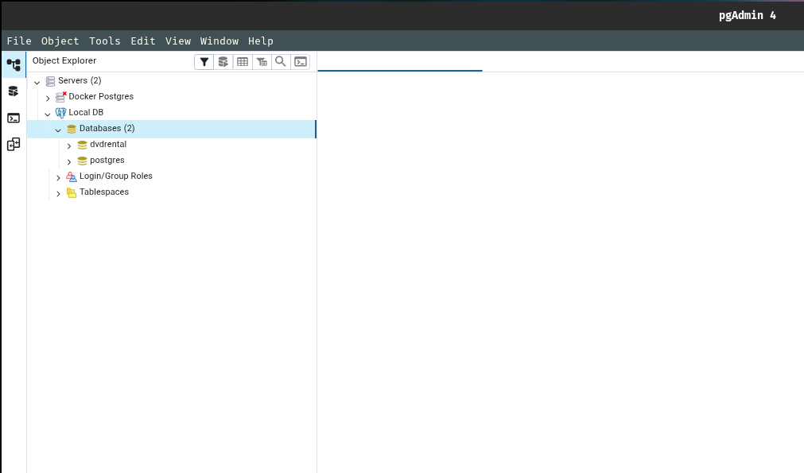
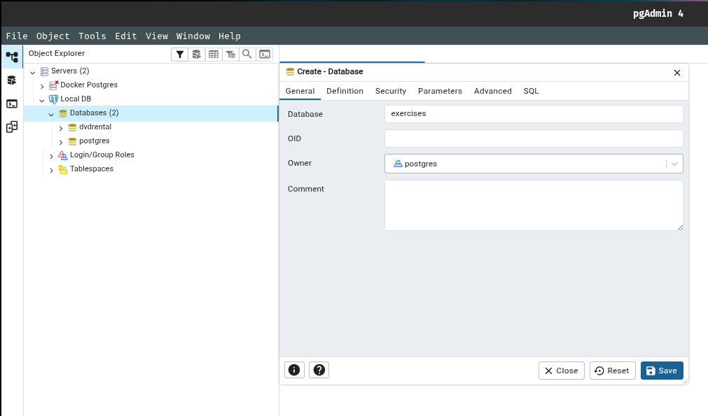
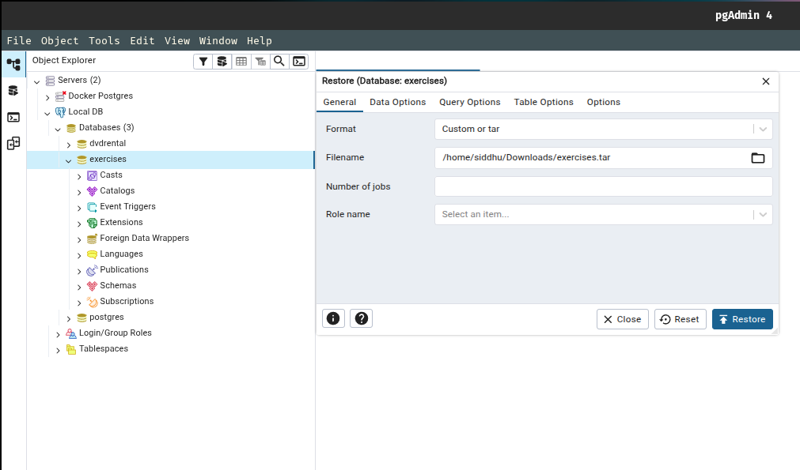
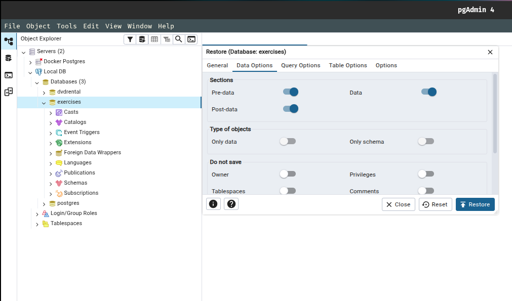
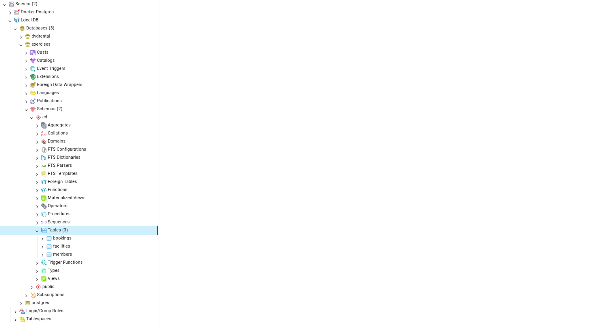

## Assessment Test 1

### COMPLETE THE FOLLOWING TASKS!

1. Return the customer IDs of customers who have spent at least $110 with the staff member who has an ID of 2.

> Answer: The answer should be customers 187 and 148.

> Table (**SELECT * FROM payment LIMIT 5**):

<table border="1" class="dataframe">
  <thead>
    <tr style="text-align: right;">
      <th></th>
      <th>payment_id</th>
      <th>customer_id</th>
      <th>staff_id</th>
      <th>rental_id</th>
      <th>amount</th>
      <th>payment_date</th>
    </tr>
  </thead>
  <tbody>
    <tr>
      <th>0</th>
      <td>17503</td>
      <td>341</td>
      <td>2</td>
      <td>1520</td>
      <td>7.99</td>
      <td>2007-02-15 22:25:46.996577</td>
    </tr>
    <tr>
      <th>1</th>
      <td>17504</td>
      <td>341</td>
      <td>1</td>
      <td>1778</td>
      <td>1.99</td>
      <td>2007-02-16 17:23:14.996577</td>
    </tr>
    <tr>
      <th>2</th>
      <td>17505</td>
      <td>341</td>
      <td>1</td>
      <td>1849</td>
      <td>7.99</td>
      <td>2007-02-16 22:41:45.996577</td>
    </tr>
    <tr>
      <th>3</th>
      <td>17506</td>
      <td>341</td>
      <td>2</td>
      <td>2829</td>
      <td>2.99</td>
      <td>2007-02-19 19:39:56.996577</td>
    </tr>
    <tr>
      <th>4</th>
      <td>17507</td>
      <td>341</td>
      <td>2</td>
      <td>3130</td>
      <td>7.99</td>
      <td>2007-02-20 17:31:48.996577</td>
    </tr>
  </tbody>
</table>

> My Solution:

```sql
SELECT 
	customer_id, 
	SUM(amount) 
FROM payment
WHERE staff_id = 2
GROUP BY customer_id
HAVING SUM(amount) >= 110;
```
<table border="1" class="dataframe">
  <thead>
    <tr style="text-align: right;">
      <th></th>
      <th>customer_id</th>
      <th>SUM(amount)</th>
    </tr>
  </thead>
  <tbody>
    <tr>
      <th>0</th>
      <td>148</td>
      <td>110.78</td>
    </tr>
    <tr>
      <th>1</th>
      <td>187</td>
      <td>110.81</td>
    </tr>
  </tbody>
</table>

> Course Solution:

```sql
SELECT customer_id, SUM(amount)
FROM payment
WHERE staff_id = 2
GROUP BY customer_id
HAVING SUM(amount) > 110;
```
<table border="1" class="dataframe">
  <thead>
    <tr style="text-align: right;">
      <th></th>
      <th>customer_id</th>
      <th>SUM(amount)</th>
    </tr>
  </thead>
  <tbody>
    <tr>
      <th>0</th>
      <td>148</td>
      <td>110.78</td>
    </tr>
    <tr>
      <th>1</th>
      <td>187</td>
      <td>110.81</td>
    </tr>
  </tbody>
</table>

---

2. How many films begin with the letter J?

> Answer: The answer should be 20.

> Table (**SELECT * FROM film LIMIT 5**):

<table border="1" class="dataframe">
  <thead>
    <tr style="text-align: right;">
      <th></th>
      <th>film_id</th>
      <th>title</th>
      <th>description</th>
      <th>release_year</th>
      <th>language_id</th>
      <th>rental_duration</th>
      <th>rental_rate</th>
      <th>length</th>
      <th>replacement_cost</th>
      <th>rating</th>
      <th>last_update</th>
      <th>special_features</th>
      <th>fulltext</th>
    </tr>
  </thead>
  <tbody>
    <tr>
      <th>0</th>
      <td>133</td>
      <td>Chamber Italian</td>
      <td>A Fateful Reflection of a Moose And a Husband ...</td>
      <td>2006</td>
      <td>1</td>
      <td>7</td>
      <td>4.99</td>
      <td>117</td>
      <td>14.99</td>
      <td>NC-17</td>
      <td>2013-05-26 14:50:58.951</td>
      <td>{Trailers}</td>
      <td>'chamber':1 'fate':4 'husband':11 'italian':2 ...</td>
    </tr>
    <tr>
      <th>1</th>
      <td>384</td>
      <td>Grosse Wonderful</td>
      <td>A Epic Drama of a Cat And a Explorer who must ...</td>
      <td>2006</td>
      <td>1</td>
      <td>5</td>
      <td>4.99</td>
      <td>49</td>
      <td>19.99</td>
      <td>R</td>
      <td>2013-05-26 14:50:58.951</td>
      <td>{"Behind the Scenes"}</td>
      <td>'australia':18 'cat':8 'drama':5 'epic':4 'exp...</td>
    </tr>
    <tr>
      <th>2</th>
      <td>8</td>
      <td>Airport Pollock</td>
      <td>A Epic Tale of a Moose And a Girl who must Con...</td>
      <td>2006</td>
      <td>1</td>
      <td>6</td>
      <td>4.99</td>
      <td>54</td>
      <td>15.99</td>
      <td>R</td>
      <td>2013-05-26 14:50:58.951</td>
      <td>{Trailers}</td>
      <td>'airport':1 'ancient':18 'confront':14 'epic':...</td>
    </tr>
    <tr>
      <th>3</th>
      <td>98</td>
      <td>Bright Encounters</td>
      <td>A Fateful Yarn of a Lumberjack And a Feminist ...</td>
      <td>2006</td>
      <td>1</td>
      <td>4</td>
      <td>4.99</td>
      <td>73</td>
      <td>12.99</td>
      <td>PG-13</td>
      <td>2013-05-26 14:50:58.951</td>
      <td>{Trailers}</td>
      <td>'boat':20 'bright':1 'conquer':14 'encount':2 ...</td>
    </tr>
    <tr>
      <th>4</th>
      <td>1</td>
      <td>Academy Dinosaur</td>
      <td>A Epic Drama of a Feminist And a Mad Scientist...</td>
      <td>2006</td>
      <td>1</td>
      <td>6</td>
      <td>0.99</td>
      <td>86</td>
      <td>20.99</td>
      <td>PG</td>
      <td>2013-05-26 14:50:58.951</td>
      <td>{"Deleted Scenes","Behind the Scenes"}</td>
      <td>'academi':1 'battl':15 'canadian':20 'dinosaur...</td>
    </tr>
  </tbody>
</table>

> My Solution:

```sql
SELECT COUNT(*) FROM film
WHERE title LIKE 'J%';
```

<table border="1" class="dataframe">
  <thead>
    <tr style="text-align: right;">
      <th></th>
      <th>COUNT(*)</th>
    </tr>
  </thead>
  <tbody>
    <tr>
      <th>0</th>
      <td>20</td>
    </tr>
  </tbody>
</table>

> Course Solution:

```sql
SELECT COUNT(*) FROM film
WHERE title LIKE 'J%';
```

<table border="1" class="dataframe">
  <thead>
    <tr style="text-align: right;">
      <th></th>
      <th>COUNT(*)</th>
    </tr>
  </thead>
  <tbody>
    <tr>
      <th>0</th>
      <td>20</td>
    </tr>
  </tbody>
</table>

---

3. What customer has the highest customer ID number whose name starts with an 'E' and has an address ID lower than 500?

> Answer: The answer is Eddie Tomlin

> Table (**SELECT * FROM customer LIMIT 5**):

<table border="1" class="dataframe">
  <thead>
    <tr style="text-align: right;">
      <th></th>
      <th>customer_id</th>
      <th>store_id</th>
      <th>first_name</th>
      <th>last_name</th>
      <th>email</th>
      <th>address_id</th>
      <th>activebool</th>
      <th>create_date</th>
      <th>last_update</th>
      <th>active</th>
    </tr>
  </thead>
  <tbody>
    <tr>
      <th>0</th>
      <td>524</td>
      <td>1</td>
      <td>Jared</td>
      <td>Ely</td>
      <td>jared.ely@sakilacustomer.org</td>
      <td>530</td>
      <td>1</td>
      <td>2006-02-14</td>
      <td>2013-05-26 14:49:45.738</td>
      <td>1</td>
    </tr>
    <tr>
      <th>1</th>
      <td>1</td>
      <td>1</td>
      <td>Mary</td>
      <td>Smith</td>
      <td>mary.smith@sakilacustomer.org</td>
      <td>5</td>
      <td>1</td>
      <td>2006-02-14</td>
      <td>2013-05-26 14:49:45.738</td>
      <td>1</td>
    </tr>
    <tr>
      <th>2</th>
      <td>2</td>
      <td>1</td>
      <td>Patricia</td>
      <td>Johnson</td>
      <td>patricia.johnson@sakilacustomer.org</td>
      <td>6</td>
      <td>1</td>
      <td>2006-02-14</td>
      <td>2013-05-26 14:49:45.738</td>
      <td>1</td>
    </tr>
    <tr>
      <th>3</th>
      <td>3</td>
      <td>1</td>
      <td>Linda</td>
      <td>Williams</td>
      <td>linda.williams@sakilacustomer.org</td>
      <td>7</td>
      <td>1</td>
      <td>2006-02-14</td>
      <td>2013-05-26 14:49:45.738</td>
      <td>1</td>
    </tr>
    <tr>
      <th>4</th>
      <td>4</td>
      <td>2</td>
      <td>Barbara</td>
      <td>Jones</td>
      <td>barbara.jones@sakilacustomer.org</td>
      <td>8</td>
      <td>1</td>
      <td>2006-02-14</td>
      <td>2013-05-26 14:49:45.738</td>
      <td>1</td>
    </tr>
  </tbody>
</table>

> My Solution:

```sql
SELECT first_name, last_name FROM customer
WHERE first_name LIKE 'E%' AND address_id < 500
ORDER BY customer_id DESC
LIMIT 1;
```
<table border="1" class="dataframe">
  <thead>
    <tr style="text-align: right;">
      <th></th>
      <th>first_name</th>
      <th>last_name</th>
    </tr>
  </thead>
  <tbody>
    <tr>
      <th>0</th>
      <td>Eddie</td>
      <td>Tomlin</td>
    </tr>
  </tbody>
</table>

> Course Solution:

```sql
SELECT first_name, last_name FROM customer
WHERE first_name LIKE 'E%'
    AND address_id <500
ORDER BY customer_id DESC
LIMIT 1;
```
<table border="1" class="dataframe">
  <thead>
    <tr style="text-align: right;">
      <th></th>
      <th>first_name</th>
      <th>last_name</th>
    </tr>
  </thead>
  <tbody>
    <tr>
      <th>0</th>
      <td>Eddie</td>
      <td>Tomlin</td>
    </tr>
  </tbody>
</table>

---

## Assessment Test 2 

- We will use a new database for a set of exercise questions.

- This database has a public and cd schema.

- This means the queries for the from tables will have **cd.** in front of them, for example:

  - SELECT * FROM cd.bookings
  - SELECT * FROM cd.facilities

### Restore new exercises database

1. Download the database from the below link.

```text
https://github.com/SiddhuShkya/SQL-Bootcamp-Zero-To-Hero/blob/main/database/exercises.tar
```

2. Open up your pgadmin and right click on database after connecting to your postgresql server.



3. Right click on database and create.

> Database -> exercises



4. Hit save button and right click on the new exercises database and then click on restore.



5. After clicking restore and uploading the filename/filepath to your exercises.tar, go to data options tab and enable **Pre-data**, **Data** & **Post-Data**



6. Refresh the **exercises** database and view the tables from the **cd** schema.

> Go to: exercises -> Schemas -> cd -> Tables



> You can see that we have 3 tables:

- booking
- facitiles
- members

7. View the all table's data using the Query Tool.

> bookings 

```sql
SELECT * FROM cd.bookings;
```

<table border="1" class="dataframe">
  <thead>
    <tr style="text-align: right;">
      <th></th>
      <th>bookid</th>
      <th>facid</th>
      <th>memid</th>
      <th>starttime</th>
      <th>slots</th>
    </tr>
  </thead>
  <tbody>
    <tr>
      <th>0</th>
      <td>0</td>
      <td>3</td>
      <td>1</td>
      <td>2012-07-03 11:00:00</td>
      <td>2</td>
    </tr>
    <tr>
      <th>1</th>
      <td>1</td>
      <td>4</td>
      <td>1</td>
      <td>2012-07-03 08:00:00</td>
      <td>2</td>
    </tr>
    <tr>
      <th>2</th>
      <td>2</td>
      <td>6</td>
      <td>0</td>
      <td>2012-07-03 18:00:00</td>
      <td>2</td>
    </tr>
    <tr>
      <th>3</th>
      <td>3</td>
      <td>7</td>
      <td>1</td>
      <td>2012-07-03 19:00:00</td>
      <td>2</td>
    </tr>
    <tr>
      <th>4</th>
      <td>4</td>
      <td>8</td>
      <td>1</td>
      <td>2012-07-03 10:00:00</td>
      <td>1</td>
    </tr>
  </tbody>
</table>

> facilities

```sql
SELECT * FROM cd.facilities;
```

<table border="1" class="dataframe">
  <thead>
    <tr style="text-align: right;">
      <th></th>
      <th>facid</th>
      <th>name</th>
      <th>membercost</th>
      <th>guestcost</th>
      <th>initialoutlay</th>
      <th>monthlymaintenance</th>
    </tr>
  </thead>
  <tbody>
    <tr>
      <th>0</th>
      <td>0</td>
      <td>Tennis Court 1</td>
      <td>5.0</td>
      <td>25.0</td>
      <td>10000.0</td>
      <td>200.0</td>
    </tr>
    <tr>
      <th>1</th>
      <td>1</td>
      <td>Tennis Court 2</td>
      <td>5.0</td>
      <td>25.0</td>
      <td>8000.0</td>
      <td>200.0</td>
    </tr>
    <tr>
      <th>2</th>
      <td>2</td>
      <td>Badminton Court</td>
      <td>0.0</td>
      <td>15.5</td>
      <td>4000.0</td>
      <td>50.0</td>
    </tr>
    <tr>
      <th>3</th>
      <td>3</td>
      <td>Table Tennis</td>
      <td>0.0</td>
      <td>5.0</td>
      <td>320.0</td>
      <td>10.0</td>
    </tr>
    <tr>
      <th>4</th>
      <td>4</td>
      <td>Massage Room 1</td>
      <td>35.0</td>
      <td>80.0</td>
      <td>4000.0</td>
      <td>3000.0</td>
    </tr>
  </tbody>
</table>

> members

```sql
SELECT * FROM cd.members;
```

<div>
<table border="1" class="dataframe">
  <thead>
    <tr style="text-align: right;">
      <th></th>
      <th>memid</th>
      <th>surname</th>
      <th>firstname</th>
      <th>address</th>
      <th>zipcode</th>
      <th>telephone</th>
      <th>recommendedby</th>
      <th>joindate</th>
    </tr>
  </thead>
  <tbody>
    <tr>
      <th>0</th>
      <td>0</td>
      <td>GUEST</td>
      <td>GUEST</td>
      <td>GUEST</td>
      <td>0</td>
      <td>(000) 000-0000</td>
      <td>NaN</td>
      <td>2012-07-01 00:00:00</td>
    </tr>
    <tr>
      <th>1</th>
      <td>1</td>
      <td>Smith</td>
      <td>Darren</td>
      <td>8 Bloomsbury Close, Boston</td>
      <td>4321</td>
      <td>555-555-5555</td>
      <td>NaN</td>
      <td>2012-07-02 12:02:05</td>
    </tr>
    <tr>
      <th>2</th>
      <td>2</td>
      <td>Smith</td>
      <td>Tracy</td>
      <td>8 Bloomsbury Close, New York</td>
      <td>4321</td>
      <td>555-555-5555</td>
      <td>NaN</td>
      <td>2012-07-02 12:08:23</td>
    </tr>
    <tr>
      <th>3</th>
      <td>3</td>
      <td>Rownam</td>
      <td>Tim</td>
      <td>23 Highway Way, Boston</td>
      <td>23423</td>
      <td>(844) 693-0723</td>
      <td>NaN</td>
      <td>2012-07-03 09:32:15</td>
    </tr>
    <tr>
      <th>4</th>
      <td>4</td>
      <td>Joplette</td>
      <td>Janice</td>
      <td>20 Crossing Road, New York</td>
      <td>234</td>
      <td>(833) 942-4710</td>
      <td>1.0</td>
      <td>2012-07-03 10:25:05</td>
    </tr>
  </tbody>
</table>

*The database required to do the assessment 2 tasks has been successfully restored....*

### COMPLETE THE FOLLOWING TASKS!

> How can you retrieve all the information from the cd.facilities table ?

```sql
SELECT * FROM cd.facilities;
```

<table border="1" class="dataframe">
  <thead>
    <tr style="text-align: right;">
      <th></th>
      <th>facid</th>
      <th>name</th>
      <th>membercost</th>
      <th>guestcost</th>
      <th>initialoutlay</th>
      <th>monthlymaintenance</th>
    </tr>
  </thead>
  <tbody>
    <tr>
      <th>0</th>
      <td>0</td>
      <td>Tennis Court 1</td>
      <td>5.0</td>
      <td>25.0</td>
      <td>10000.0</td>
      <td>200.0</td>
    </tr>
    <tr>
      <th>1</th>
      <td>1</td>
      <td>Tennis Court 2</td>
      <td>5.0</td>
      <td>25.0</td>
      <td>8000.0</td>
      <td>200.0</td>
    </tr>
    <tr>
      <th>2</th>
      <td>2</td>
      <td>Badminton Court</td>
      <td>0.0</td>
      <td>15.5</td>
      <td>4000.0</td>
      <td>50.0</td>
    </tr>
    <tr>
      <th>3</th>
      <td>3</td>
      <td>Table Tennis</td>
      <td>0.0</td>
      <td>5.0</td>
      <td>320.0</td>
      <td>10.0</td>
    </tr>
    <tr>
      <th>4</th>
      <td>4</td>
      <td>Massage Room 1</td>
      <td>35.0</td>
      <td>80.0</td>
      <td>4000.0</td>
      <td>3000.0</td>
    </tr>
    <tr>
      <th>5</th>
      <td>5</td>
      <td>Massage Room 2</td>
      <td>35.0</td>
      <td>80.0</td>
      <td>4000.0</td>
      <td>3000.0</td>
    </tr>
    <tr>
      <th>6</th>
      <td>6</td>
      <td>Squash Court</td>
      <td>3.5</td>
      <td>17.5</td>
      <td>5000.0</td>
      <td>80.0</td>
    </tr>
    <tr>
      <th>7</th>
      <td>7</td>
      <td>Snooker Table</td>
      <td>0.0</td>
      <td>5.0</td>
      <td>450.0</td>
      <td>15.0</td>
    </tr>
    <tr>
      <th>8</th>
      <td>8</td>
      <td>Pool Table</td>
      <td>0.0</td>
      <td>5.0</td>
      <td>400.0</td>
      <td>15.0</td>
    </tr>
  </tbody>
</table>

> [!IMPORTANT]
> We needed to include that cd because the facilities table is under the public schema and not the public schema.

> How would you retrieve a list of only facility names and costs?

```sql
SELECT name, membercost  FROM cd.facilities;
```

<table border="1" class="dataframe">
  <thead>
    <tr style="text-align: right;">
      <th></th>
      <th>name</th>
      <th>membercost</th>
    </tr>
  </thead>
  <tbody>
    <tr>
      <th>0</th>
      <td>Tennis Court 1</td>
      <td>5.0</td>
    </tr>
    <tr>
      <th>1</th>
      <td>Tennis Court 2</td>
      <td>5.0</td>
    </tr>
    <tr>
      <th>2</th>
      <td>Badminton Court</td>
      <td>0.0</td>
    </tr>
    <tr>
      <th>3</th>
      <td>Table Tennis</td>
      <td>0.0</td>
    </tr>
    <tr>
      <th>4</th>
      <td>Massage Room 1</td>
      <td>35.0</td>
    </tr>
    <tr>
      <th>5</th>
      <td>Massage Room 2</td>
      <td>35.0</td>
    </tr>
    <tr>
      <th>6</th>
      <td>Squash Court</td>
      <td>3.5</td>
    </tr>
    <tr>
      <th>7</th>
      <td>Snooker Table</td>
      <td>0.0</td>
    </tr>
    <tr>
      <th>8</th>
      <td>Pool Table</td>
      <td>0.0</td>
    </tr>
  </tbody>
</table>

> How can you produce a list of facilities that charge a fee to members?

```sql
SELECT name, membercost  FROM cd.facilities
WHERE membercost > 0;
```
<table border="1" class="dataframe">
  <thead>
    <tr style="text-align: right;">
      <th></th>
      <th>name</th>
      <th>membercost</th>
    </tr>
  </thead>
  <tbody>
    <tr>
      <th>0</th>
      <td>Tennis Court 1</td>
      <td>5.0</td>
    </tr>
    <tr>
      <th>1</th>
      <td>Tennis Court 2</td>
      <td>5.0</td>
    </tr>
    <tr>
      <th>2</th>
      <td>Massage Room 1</td>
      <td>35.0</td>
    </tr>
    <tr>
      <th>3</th>
      <td>Massage Room 2</td>
      <td>35.0</td>
    </tr>
    <tr>
      <th>4</th>
      <td>Squash Court</td>
      <td>3.5</td>
    </tr>
  </tbody>
</table>

> How can you produce a list of facilities that charge a fee to members, and that fee is less than 1/50th of the monthly mainteanance cost? Return the facid, facility name, member cost, and monthly mainteanance of the facilities in question.

```sql
SELECT facid, name, membercost, monthlymaintenance FROM cd.facilities
WHERE membercost < (monthlymaintenance / 50.0) AND membercost > 0;
```
<table border="1" class="dataframe">
  <thead>
    <tr style="text-align: right;">
      <th></th>
      <th>facid</th>
      <th>name</th>
      <th>membercost</th>
      <th>monthlymaintenance</th>
    </tr>
  </thead>
  <tbody>
    <tr>
      <th>0</th>
      <td>4</td>
      <td>Massage Room 1</td>
      <td>35.0</td>
      <td>3000.0</td>
    </tr>
    <tr>
      <th>1</th>
      <td>5</td>
      <td>Massage Room 2</td>
      <td>35.0</td>
      <td>3000.0</td>
    </tr>
  </tbody>
</table>

> How can you produce a list of all facilities with the word 'Tennis' in their name?

```sql
SELECT * FROM cd.facilities
WHERE name LIKE '%Tennis%';
```
<table border="1" class="dataframe">
  <thead>
    <tr style="text-align: right;">
      <th></th>
      <th>facid</th>
      <th>name</th>
      <th>membercost</th>
      <th>guestcost</th>
      <th>initialoutlay</th>
      <th>monthlymaintenance</th>
    </tr>
  </thead>
  <tbody>
    <tr>
      <th>0</th>
      <td>0</td>
      <td>Tennis Court 1</td>
      <td>5.0</td>
      <td>25.0</td>
      <td>10000.0</td>
      <td>200.0</td>
    </tr>
    <tr>
      <th>1</th>
      <td>1</td>
      <td>Tennis Court 2</td>
      <td>5.0</td>
      <td>25.0</td>
      <td>8000.0</td>
      <td>200.0</td>
    </tr>
    <tr>
      <th>2</th>
      <td>3</td>
      <td>Table Tennis</td>
      <td>0.0</td>
      <td>5.0</td>
      <td>320.0</td>
      <td>10.0</td>
    </tr>
  </tbody>
</table>

> How can you you retrieve the details of facilities with ID 1 and 5? Try to do it without using the OR Operator.

- With OR operator:

```sql
SELECT * FROM cd.facilities
WHERE facid = 1 OR facid = 5;
```

- Without OR operator:

*Solution 1:*

```sql
SELECT * FROM cd.facilities
WHERE facid IN (1, 5);
```

*Solution 2:*

```sql
SELECT * FROM cd.facilities
WHERE facid = 1

UNION

SELECT * FROM cd.facilities
WHERE facid = 5;
```

> Output:

<table border="1" class="dataframe">
  <thead>
    <tr style="text-align: right;">
      <th></th>
      <th>facid</th>
      <th>name</th>
      <th>membercost</th>
      <th>guestcost</th>
      <th>initialoutlay</th>
      <th>monthlymaintenance</th>
    </tr>
  </thead>
  <tbody>
    <tr>
      <th>0</th>
      <td>1</td>
      <td>Tennis Court 2</td>
      <td>5.0</td>
      <td>25.0</td>
      <td>8000.0</td>
      <td>200.0</td>
    </tr>
    <tr>
      <th>1</th>
      <td>5</td>
      <td>Massage Room 2</td>
      <td>35.0</td>
      <td>80.0</td>
      <td>4000.0</td>
      <td>3000.0</td>
    </tr>
  </tbody>
</table>

> How can you produce a list of members who joined after the start of september 2012? Return the memid, surname, firstname, and joindate of the members in question?

```sql
SELECT memid, surname, firstname, joindate FROM cd.members
WHERE joindate >= '2012-09-01 00:00:00';
```

<table border="1" class="dataframe">
  <thead>
    <tr style="text-align: right;">
      <th></th>
      <th>memid</th>
      <th>surname</th>
      <th>firstname</th>
      <th>joindate</th>
    </tr>
  </thead>
  <tbody>
    <tr>
      <th>0</th>
      <td>24</td>
      <td>Sarwin</td>
      <td>Ramnaresh</td>
      <td>2012-09-01 08:44:42</td>
    </tr>
    <tr>
      <th>1</th>
      <td>26</td>
      <td>Jones</td>
      <td>Douglas</td>
      <td>2012-09-02 18:43:05</td>
    </tr>
    <tr>
      <th>2</th>
      <td>27</td>
      <td>Rumney</td>
      <td>Henrietta</td>
      <td>2012-09-05 08:42:35</td>
    </tr>
    <tr>
      <th>3</th>
      <td>28</td>
      <td>Farrell</td>
      <td>David</td>
      <td>2012-09-15 08:22:05</td>
    </tr>
    <tr>
      <th>4</th>
      <td>29</td>
      <td>Worthington-Smyth</td>
      <td>Henry</td>
      <td>2012-09-17 12:27:15</td>
    </tr>
    <tr>
      <th>5</th>
      <td>30</td>
      <td>Purview</td>
      <td>Millicent</td>
      <td>2012-09-18 19:04:01</td>
    </tr>
    <tr>
      <th>6</th>
      <td>33</td>
      <td>Tupperware</td>
      <td>Hyacinth</td>
      <td>2012-09-18 19:32:05</td>
    </tr>
    <tr>
      <th>7</th>
      <td>35</td>
      <td>Hunt</td>
      <td>John</td>
      <td>2012-09-19 11:32:45</td>
    </tr>
    <tr>
      <th>8</th>
      <td>36</td>
      <td>Crumpet</td>
      <td>Erica</td>
      <td>2012-09-22 08:36:38</td>
    </tr>
    <tr>
      <th>9</th>
      <td>37</td>
      <td>Smith</td>
      <td>Darren</td>
      <td>2012-09-26 18:08:45</td>
    </tr>
  </tbody>
</table>

> How can you produce an ordered list of the first 10 surnames in the members table? The list must not contain duplicates.

```sql
SELECT DISTINCT surname FROM cd.members
ORDER BY surname
LIMIT 10;
```

<table border="1" class="dataframe">
  <thead>
    <tr style="text-align: right;">
      <th></th>
      <th>surname</th>
    </tr>
  </thead>
  <tbody>
    <tr>
      <th>0</th>
      <td>Bader</td>
    </tr>
    <tr>
      <th>1</th>
      <td>Baker</td>
    </tr>
    <tr>
      <th>2</th>
      <td>Boothe</td>
    </tr>
    <tr>
      <th>3</th>
      <td>Butters</td>
    </tr>
    <tr>
      <th>4</th>
      <td>Coplin</td>
    </tr>
    <tr>
      <th>5</th>
      <td>Crumpet</td>
    </tr>
    <tr>
      <th>6</th>
      <td>Dare</td>
    </tr>
    <tr>
      <th>7</th>
      <td>Farrell</td>
    </tr>
    <tr>
      <th>8</th>
      <td>Genting</td>
    </tr>
    <tr>
      <th>9</th>
      <td>GUEST</td>
    </tr>
  </tbody>
</table>

> You'd like to get signup date of your last member. How can you retrieve this information?

*Solution 1:*

```sql
SELECT joindate AS last_signup_date FROM cd.members
ORDER BY joindate DESC
LIMIT 1;
```

*Solution 2:*

```sql
SELECT MAX(joindate) AS last_signup_date
FROM cd.members;
```

*Output:*

<table border="1" class="dataframe">
  <thead>
    <tr style="text-align: right;">
      <th></th>
      <th>last_signup_date</th>
    </tr>
  </thead>
  <tbody>
    <tr>
      <th>0</th>
      <td>2012-09-26 18:08:45</td>
    </tr>
  </tbody>
</table>

> Produce a count of the number of facilities that have a cost to guests of 10 or more.

```sql
SELECT COUNT(*) FROM cd.facilities
WHERE guestcost >= 10;
```

<table border="1" class="dataframe">
  <thead>
    <tr style="text-align: right;">
      <th></th>
      <th>count</th>
    </tr>
  </thead>
  <tbody>
    <tr>
      <th>0</th>
      <td>6</td>
    </tr>
  </tbody>
</table>

> Produce a list of of the total number of slots booked per facility in the month of september 2012. Produce an output table consisting of facility id and slots, sorted by the number of slots.

```sql
SELECT facid, SUM(slots) AS total_slots
FROM cd.bookings
WHERE starttime >= '2012-09-01 00:00:00' 
  AND starttime < '2012-10-01 00:00:00'
GROUP BY facid
ORDER BY total_slots;
```

<table border="1" class="dataframe">
  <thead>
    <tr style="text-align: right;">
      <th></th>
      <th>facid</th>
      <th>total_slots</th>
    </tr>
  </thead>
  <tbody>
    <tr>
      <th>0</th>
      <td>5</td>
      <td>122</td>
    </tr>
    <tr>
      <th>1</th>
      <td>3</td>
      <td>422</td>
    </tr>
    <tr>
      <th>2</th>
      <td>7</td>
      <td>426</td>
    </tr>
    <tr>
      <th>3</th>
      <td>8</td>
      <td>471</td>
    </tr>
    <tr>
      <th>4</th>
      <td>6</td>
      <td>540</td>
    </tr>
    <tr>
      <th>5</th>
      <td>2</td>
      <td>570</td>
    </tr>
    <tr>
      <th>6</th>
      <td>1</td>
      <td>588</td>
    </tr>
    <tr>
      <th>7</th>
      <td>0</td>
      <td>591</td>
    </tr>
    <tr>
      <th>8</th>
      <td>4</td>
      <td>648</td>
    </tr>
  </tbody>
</table>

> Produce a list of facilities with more than 1000 slots booked. Produce an output table consisting of facility id and total slots, sorted by facility id.

```sql
SELECT facid, SUM(slots) AS total_slots 
FROM cd.bookings
GROUP BY facid
HAVING SUM(slots) > 1000
ORDER BY facid;
```

<table border="1" class="dataframe">
  <thead>
    <tr style="text-align: right;">
      <th></th>
      <th>facid</th>
      <th>total_slots</th>
    </tr>
  </thead>
  <tbody>
    <tr>
      <th>0</th>
      <td>0</td>
      <td>1320</td>
    </tr>
    <tr>
      <th>1</th>
      <td>1</td>
      <td>1278</td>
    </tr>
    <tr>
      <th>2</th>
      <td>2</td>
      <td>1209</td>
    </tr>
    <tr>
      <th>3</th>
      <td>4</td>
      <td>1404</td>
    </tr>
    <tr>
      <th>4</th>
      <td>6</td>
      <td>1104</td>
    </tr>
  </tbody>
</table>

> How can you produce a list of the start times for booking for tennis courts, for the date '2012-09-21'? Return a list of stat time and facility name pairings, ordered by the time.

```sql
SELECT f.name, b.starttime 
FROM cd.facilities f
INNER JOIN cd.bookings b
	ON f.facid = b.facid
WHERE (b.starttime >= '2012-09-21' AND b.starttime < '2012-09-22')
	AND f.name IN ('Tennis Court 1', 'Tennis Court 2')
ORDER BY b.starttime;
```

<table border="1" class="dataframe">
  <thead>
    <tr style="text-align: right;">
      <th></th>
      <th>name</th>
      <th>starttime</th>
    </tr>
  </thead>
  <tbody>
    <tr>
      <th>0</th>
      <td>Tennis Court 1</td>
      <td>2012-09-21 08:00:00</td>
    </tr>
    <tr>
      <th>1</th>
      <td>Tennis Court 2</td>
      <td>2012-09-21 08:00:00</td>
    </tr>
    <tr>
      <th>2</th>
      <td>Tennis Court 1</td>
      <td>2012-09-21 09:30:00</td>
    </tr>
    <tr>
      <th>3</th>
      <td>Tennis Court 2</td>
      <td>2012-09-21 10:00:00</td>
    </tr>
    <tr>
      <th>4</th>
      <td>Tennis Court 2</td>
      <td>2012-09-21 11:30:00</td>
    </tr>
    <tr>
      <th>5</th>
      <td>Tennis Court 1</td>
      <td>2012-09-21 12:00:00</td>
    </tr>
    <tr>
      <th>6</th>
      <td>Tennis Court 1</td>
      <td>2012-09-21 13:30:00</td>
    </tr>
    <tr>
      <th>7</th>
      <td>Tennis Court 2</td>
      <td>2012-09-21 14:00:00</td>
    </tr>
    <tr>
      <th>8</th>
      <td>Tennis Court 1</td>
      <td>2012-09-21 15:30:00</td>
    </tr>
    <tr>
      <th>9</th>
      <td>Tennis Court 2</td>
      <td>2012-09-21 16:00:00</td>
    </tr>
    <tr>
      <th>10</th>
      <td>Tennis Court 1</td>
      <td>2012-09-21 17:00:00</td>
    </tr>
    <tr>
      <th>11</th>
      <td>Tennis Court 2</td>
      <td>2012-09-21 18:00:00</td>
    </tr>
  </tbody>
</table>

> How can you produce a list of the start times for bookings by members named 'David Farrell'?

```sql
SELECT b.starttime
FROM cd.members m
INNER JOIN cd.bookings b
	ON m.memid = b.memid
WHERE firstname = 'David' AND surname = 'Farrell';
```

<table border="1" class="dataframe">
  <thead>
    <tr style="text-align: right;">
      <th></th>
      <th>starttime</th>
    </tr>
  </thead>
  <tbody>
    <tr>
      <th>0</th>
      <td>2012-09-18 09:00:00</td>
    </tr>
    <tr>
      <th>1</th>
      <td>2012-09-18 13:30:00</td>
    </tr>
    <tr>
      <th>2</th>
      <td>2012-09-18 17:30:00</td>
    </tr>
    <tr>
      <th>3</th>
      <td>2012-09-18 20:00:00</td>
    </tr>
    <tr>
      <th>4</th>
      <td>2012-09-19 09:30:00</td>
    </tr>
    <tr>
      <th>5</th>
      <td>2012-09-19 12:00:00</td>
    </tr>
    <tr>
      <th>6</th>
      <td>2012-09-19 15:00:00</td>
    </tr>
    <tr>
      <th>7</th>
      <td>2012-09-20 11:30:00</td>
    </tr>
    <tr>
      <th>8</th>
      <td>2012-09-20 14:00:00</td>
    </tr>
    <tr>
      <th>9</th>
      <td>2012-09-20 15:30:00</td>
    </tr>
  </tbody>
</table>