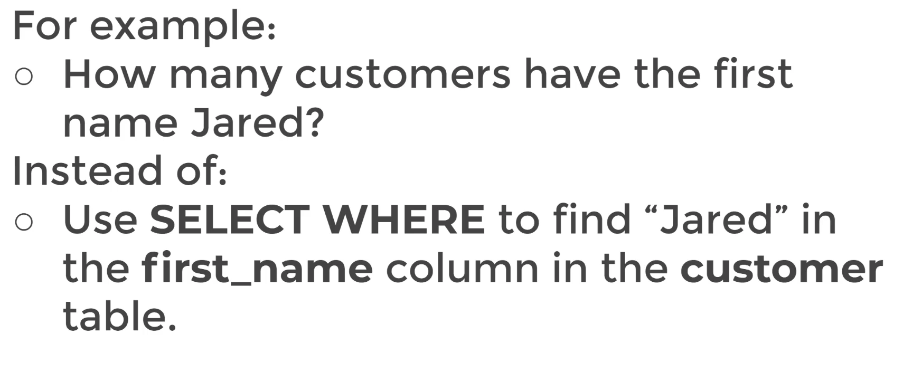

## Challenge Tasks

This document will contain all the challenges that were presented to me for a better learning experience. Challenges are structured in the below manners:

- Business Situation
- Challenge Question
- Expected Answer
- Hints
- Solution

---

### 1. SELECT 

> `Business Situation` : We want to send out promotional email to our existing customers!

> `Challenge` : Use a SELECT statement to grab the first and last names of every cutsomers and their email addresses.

> `Expected Answer`: 

<table border="1" class="dataframe">
  <thead>
    <tr style="text-align: right;">
      <th></th>
      <th>first_name</th>
      <th>last_name</th>
      <th>email</th>
    </tr>
  </thead>
  <tbody>
    <tr>
      <th>0</th>
      <td>Jared</td>
      <td>Ely</td>
      <td>jared.ely@sakilacustomer.org</td>
    </tr>
    <tr>
      <th>1</th>
      <td>Mary</td>
      <td>Smith</td>
      <td>mary.smith@sakilacustomer.org</td>
    </tr>
    <tr>
      <th>2</th>
      <td>Patricia</td>
      <td>Johnson</td>
      <td>patricia.johnson@sakilacustomer.org</td>
    </tr>
    <tr>
      <th>3</th>
      <td>Linda</td>
      <td>Williams</td>
      <td>linda.williams@sakilacustomer.org</td>
    </tr>
    <tr>
      <th>4</th>
      <td>Barbara</td>
      <td>Jones</td>
      <td>barbara.jones@sakilacustomer.org</td>
    </tr>
  </tbody>
</table>

> `Hints`:
  - Use the `customer` table
  - You can use the table drop-down to view what columns are available
  - You could also use SELECT * FROM `customer` to see all then columns

> `Solutions`:

- View all columns from `customer` table

```sql
SELECT * FROM customer;
```
<table border="1" class="dataframe">
  <thead>
    <tr style="text-align: right;">
      <th></th>
      <th>customer_id</th>
      <th>store_id</th>
      <th>first_name</th>
      <th>last_name</th>
      <th>email</th>
      <th>address_id</th>
      <th>activebool</th>
      <th>create_date</th>
      <th>last_update</th>
      <th>active</th>
    </tr>
  </thead>
  <tbody>
    <tr>
      <th>0</th>
      <td>524</td>
      <td>1</td>
      <td>Jared</td>
      <td>Ely</td>
      <td>jared.ely@sakilacustomer.org</td>
      <td>530</td>
      <td>1</td>
      <td>2006-02-14</td>
      <td>2013-05-26 14:49:45.738</td>
      <td>1</td>
    </tr>
    <tr>
      <th>1</th>
      <td>1</td>
      <td>1</td>
      <td>Mary</td>
      <td>Smith</td>
      <td>mary.smith@sakilacustomer.org</td>
      <td>5</td>
      <td>1</td>
      <td>2006-02-14</td>
      <td>2013-05-26 14:49:45.738</td>
      <td>1</td>
    </tr>
    <tr>
      <th>2</th>
      <td>2</td>
      <td>1</td>
      <td>Patricia</td>
      <td>Johnson</td>
      <td>patricia.johnson@sakilacustomer.org</td>
      <td>6</td>
      <td>1</td>
      <td>2006-02-14</td>
      <td>2013-05-26 14:49:45.738</td>
      <td>1</td>
    </tr>
    <tr>
      <th>3</th>
      <td>3</td>
      <td>1</td>
      <td>Linda</td>
      <td>Williams</td>
      <td>linda.williams@sakilacustomer.org</td>
      <td>7</td>
      <td>1</td>
      <td>2006-02-14</td>
      <td>2013-05-26 14:49:45.738</td>
      <td>1</td>
    </tr>
    <tr>
      <th>4</th>
      <td>4</td>
      <td>2</td>
      <td>Barbara</td>
      <td>Jones</td>
      <td>barbara.jones@sakilacustomer.org</td>
      <td>8</td>
      <td>1</td>
      <td>2006-02-14</td>
      <td>2013-05-26 14:49:45.738</td>
      <td>1</td>
    </tr>
  </tbody>
</table>

- View first_name, last_name, email from `customer`

```sql
SELECT first_name, last_name, email FROM customer;
```
<table border="1" class="dataframe">
  <thead>
    <tr style="text-align: right;">
      <th></th>
      <th>first_name</th>
      <th>last_name</th>
      <th>email</th>
    </tr>
  </thead>
  <tbody>
    <tr>
      <th>0</th>
      <td>Jared</td>
      <td>Ely</td>
      <td>jared.ely@sakilacustomer.org</td>
    </tr>
    <tr>
      <th>1</th>
      <td>Mary</td>
      <td>Smith</td>
      <td>mary.smith@sakilacustomer.org</td>
    </tr>
    <tr>
      <th>2</th>
      <td>Patricia</td>
      <td>Johnson</td>
      <td>patricia.johnson@sakilacustomer.org</td>
    </tr>
    <tr>
      <th>3</th>
      <td>Linda</td>
      <td>Williams</td>
      <td>linda.williams@sakilacustomer.org</td>
    </tr>
    <tr>
      <th>4</th>
      <td>Barbara</td>
      <td>Jones</td>
      <td>barbara.jones@sakilacustomer.org</td>
    </tr>
  </tbody>
</table>

---

### 2. SELECT DISTINCT

> `Business Situation`: 
- An Australian visitor isn't familiar with MPAA movie ratings (e.g. PG, PG-13, R, etc)
- We want to know the types of ratings, we have in our database.
- What ratings do we have available ? 

> `Challenge`: Use what you've learned about SELECT DISTINCT to retrieve the distinct rating types our films could have in our database.

> `Expected Answer`: 
<table border="1" class="dataframe">
  <thead>
    <tr style="text-align: right;">
      <th></th>
      <th>rating</th>
    </tr>
  </thead>
  <tbody>
    <tr>
      <th>0</th>
      <td>NC-17</td>
    </tr>
    <tr>
      <th>1</th>
      <td>R</td>
    </tr>
    <tr>
      <th>2</th>
      <td>PG-13</td>
    </tr>
    <tr>
      <th>3</th>
      <td>PG</td>
    </tr>
    <tr>
      <th>4</th>
      <td>G</td>
    </tr>
  </tbody>
</table>

> `Hints`:
- Use the film table
- Use SELECT * FROM film; to see what columns are available.
- Or use drop down table menu in pgadmin.

> `Solution`:

- View all the distinct rating from the `film` table

```sql
SELECT DISTINCT rating FROM film;
```
<table border="1" class="dataframe">
  <thead>
    <tr style="text-align: right;">
      <th></th>
      <th>rating</th>
    </tr>
  </thead>
  <tbody>
    <tr>
      <th>0</th>
      <td>NC-17</td>
    </tr>
    <tr>
      <th>1</th>
      <td>R</td>
    </tr>
    <tr>
      <th>2</th>
      <td>PG-13</td>
    </tr>
    <tr>
      <th>3</th>
      <td>PG</td>
    </tr>
    <tr>
      <th>4</th>
      <td>G</td>
    </tr>
  </tbody>
</table>

---

### 3. SELECT & WHERE

> [!NOTE]
> We now know enough to answer more relaistic business questions and tasks instead of directly asking for sepecific SQL tasks. Therefore, from now on we will be focusing more on directly asking the business related questions, to more realistically model a typical task.



> [!IMPORTANT]
> It is important to keep in mind that sooner or later, you are going to relaize that there are usually many different ways to arrive at the same solution. So it is also important to verify your own work against the expected result instead of the SQL solution provided by the course/lecturer.

*Now that we are on the same page, lets continue with the challenge*

---

> `Challenge 1`: 

- A customer forgot their wallet at our store! we need to track down their email to inform them.
- What is the email for the customer with the name 'Nancy Thomas'

> `Expected Answer`: 
<table border="1" class="dataframe">
  <thead>
    <tr style="text-align: right;">
      <th></th>
      <th>email</th>
    </tr>
  </thead>
  <tbody>
    <tr>
      <th>0</th>
      <td>nancy.thomas@sakilacustomer.org</td>
    </tr>
  </tbody>
</table>

> `Hints`:

- Use the customer table
- Make sure the capitalization and spelling of the names is correct
- use AND to combine conditions
- Use single quotes around the 'string'

> `Solution`:

```sql
SELECT email FROM customer
WHERE first_name = 'Nancy' AND last_name = 'Thomas';
```
<table border="1" class="dataframe">
  <thead>
    <tr style="text-align: right;">
      <th></th>
      <th>email</th>
    </tr>
  </thead>
  <tbody>
    <tr>
      <th>0</th>
      <td>nancy.thomas@sakilacustomer.org</td>
    </tr>
  </tbody>
</table>

---

> `Challenge 2`: 

- A customer wants to know what the movie "Outlaw Hanky" is about.
- Could you give them the description for the movie "Outlaw Hanky" ?

> `Expected Answer`: 
<table border="1" class="dataframe">
  <thead>
    <tr style="text-align: right;">
      <th></th>
      <th>description</th>
    </tr>
  </thead>
  <tbody>
    <tr>
      <th>0</th>
      <td>A Thoughtful Story of a Astronaut And a Compos...</td>
    </tr>
  </tbody>
</table>

> `Hints`:

- Use the film table
- Make sure the capitalization and spelling of the movie name is correct
- use AND to combine conditions
- Use single quotes around the 'string'

> `Solution`:

```sql
SELECT description FROM film
WHERE title = 'Outlaw Hanky';
```
<table border="1" class="dataframe">
  <thead>
    <tr style="text-align: right;">
      <th></th>
      <th>description</th>
    </tr>
  </thead>
  <tbody>
    <tr>
      <th>0</th>
      <td>A Thoughtful Story of a Astronaut And a Compos...</td>
    </tr>
  </tbody>
</table>

---

> `Challenge 3`: 

- A customer is late on their movie return, we've mailed them a letter to their address at '259 Ipoh Drive'. We should also called them on the phone to let them know.

- Can you get the phone number for the drive customer who lives at '259 Ipoh Drive'?

> `Expected Answer`: 

<table border="1" class="dataframe">
  <thead>
    <tr style="text-align: right;">
      <th></th>
      <th>phone</th>
    </tr>
  </thead>
  <tbody>
    <tr>
      <th>0</th>
      <td>419009857119</td>
    </tr>
  </tbody>
</table>

> `Hints`:

- Use the address table
- Make sure the capitalization and spelling of the address is correct
- Use single quotes around the 'string'

> `Solution`:

```sql
SELECT phone FROM address 
WHERE address = '259 Ipoh Drive';
```
<table border="1" class="dataframe">
  <thead>
    <tr style="text-align: right;">
      <th></th>
      <th>phone</th>
    </tr>
  </thead>
  <tbody>
    <tr>
      <th>0</th>
      <td>419009857119</td>
    </tr>
  </tbody>
</table>

> [!NOTE]
> A table can share the name with its own column. Example, in the above address table there is also a coumn named address.

---

### 4. ORDER BY

> `Challenge 1`: 

- We want to reward our first 10 paying customers.
- What are the customers ids of the first 10 customers who created a payment?

> `Expected Answer`: 
<table border="1" class="dataframe">
  <thead>
    <tr style="text-align: right;">
      <th></th>
      <th>customer_id</th>
    </tr>
  </thead>
  <tbody>
    <tr>
      <th>0</th>
      <td>416</td>
    </tr>
    <tr>
      <th>1</th>
      <td>516</td>
    </tr>
    <tr>
      <th>2</th>
      <td>239</td>
    </tr>
    <tr>
      <th>3</th>
      <td>592</td>
    </tr>
    <tr>
      <th>4</th>
      <td>49</td>
    </tr>
    <tr>
      <th>5</th>
      <td>264</td>
    </tr>
    <tr>
      <th>6</th>
      <td>46</td>
    </tr>
    <tr>
      <th>7</th>
      <td>481</td>
    </tr>
    <tr>
      <th>8</th>
      <td>139</td>
    </tr>
    <tr>
      <th>9</th>
      <td>595</td>
    </tr>
  </tbody>
</table>

> `Hints`:

- Use the payment table 
- You will need to use both ORDER BY and LIMIT 
- Remember you may need to specify ASC or DESC

> `Solution`:

```sql
SELECT customer_id FROM payment
ORDER BY payment_date ASC
LIMIT 10;
```
<table border="1" class="dataframe">
  <thead>
    <tr style="text-align: right;">
      <th></th>
      <th>customer_id</th>
    </tr>
  </thead>
  <tbody>
    <tr>
      <th>0</th>
      <td>416</td>
    </tr>
    <tr>
      <th>1</th>
      <td>516</td>
    </tr>
    <tr>
      <th>2</th>
      <td>239</td>
    </tr>
    <tr>
      <th>3</th>
      <td>592</td>
    </tr>
    <tr>
      <th>4</th>
      <td>49</td>
    </tr>
    <tr>
      <th>5</th>
      <td>264</td>
    </tr>
    <tr>
      <th>6</th>
      <td>46</td>
    </tr>
    <tr>
      <th>7</th>
      <td>481</td>
    </tr>
    <tr>
      <th>8</th>
      <td>139</td>
    </tr>
    <tr>
      <th>9</th>
      <td>595</td>
    </tr>
  </tbody>
</table>

> `Challenge 2`: 

- A customer wants to quickly rent a video to watch over their short lunch break.
- What are the titles of the 5 shortest (in length of runtime) movies?

>`Expected Answer`: 
<table border="1" class="dataframe">
  <thead>
    <tr style="text-align: right;">
      <th></th>
      <th>title</th>
      <th>length</th>
    </tr>
  </thead>
  <tbody>
    <tr>
      <th>0</th>
      <td>Alien Center</td>
      <td>46</td>
    </tr>
    <tr>
      <th>1</th>
      <td>Iron Moon</td>
      <td>46</td>
    </tr>
    <tr>
      <th>2</th>
      <td>Kwai Homeward</td>
      <td>46</td>
    </tr>
    <tr>
      <th>3</th>
      <td>Labyrinth League</td>
      <td>46</td>
    </tr>
    <tr>
      <th>4</th>
      <td>Ridgemont Submarine</td>
      <td>46</td>
    </tr>
  </tbody>
</table>

> `Hints`:

- Use the film table
- Take a look at the length column
- You can use ORDER BY and LIMIT
- Remember to use ASC or DESC to get desired results

> `Solution`:

```sql
SELECT title, length FROM film 
ORDER BY length ASC
LIMIT 5;
```

<table border="1" class="dataframe">
  <thead>
    <tr style="text-align: right;">
      <th></th>
      <th>title</th>
      <th>length</th>
    </tr>
  </thead>
  <tbody>
    <tr>
      <th>0</th>
      <td>Alien Center</td>
      <td>46</td>
    </tr>
    <tr>
      <th>1</th>
      <td>Iron Moon</td>
      <td>46</td>
    </tr>
    <tr>
      <th>2</th>
      <td>Kwai Homeward</td>
      <td>46</td>
    </tr>
    <tr>
      <th>3</th>
      <td>Labyrinth League</td>
      <td>46</td>
    </tr>
    <tr>
      <th>4</th>
      <td>Ridgemont Submarine</td>
      <td>46</td>
    </tr>
  </tbody>
</table>

> [!IMPORTANT]
> **length** is also highlighted, because it is also an SQL keyword aside from also being a column name. The above query will run as we intented it to, because it is a column name that exists in the specified table. You should try your best to avoid column names that match up with SQL keyword. One way to do this is capitalizing SQL keywords.

---

**Quick Bonus Question**:

If the previous customer can watch any movie that is 50 minutes or less in runtime, how many options does she have?

> `Expected Result` : 37

> `Solution`:

```sql
SELECT COUNT(*) FROM film
WHERE length <= 50;
```
<table border="1" class="dataframe">
  <thead>
    <tr style="text-align: right;">
      <th></th>
      <th>COUNT(*)</th>
    </tr>
  </thead>
  <tbody>
    <tr>
      <th>0</th>
      <td>37</td>
    </tr>
  </tbody>
</table>

---

### 5. General Challenges

These challenges are designed in such a way, so that we can utilize everything we have learned till now from this course.

---

> `Challenge`: 

*How many payments transactions were greater that $5.00?*

> `My Solution`:

```sql
SELECT COUNT(*) FROM payment
WHERE amount > 5.00;
```
<table border="1" class="dataframe">
  <thead>
    <tr style="text-align: right;">
      <th></th>
      <th>COUNT(*)</th>
    </tr>
  </thead>
  <tbody>
    <tr>
      <th>0</th>
      <td>3618</td>
    </tr>
  </tbody>
</table>

---

> `Challenge`: 

*How many actors have a first name that starts with the letter P?*

> `My Solution`:

```sql
SELECT COUNT(*) FROM actor
WHERE first_name LIKE 'P%';
```
<table border="1" class="dataframe">
  <thead>
    <tr style="text-align: right;">
      <th></th>
      <th>COUNT(*)</th>
    </tr>
  </thead>
  <tbody>
    <tr>
      <th>0</th>
      <td>5</td>
    </tr>
  </tbody>
</table>

---

> `Challenge`: 

*How many unique districts are our customers from?*

> `My Solution`:

```sql
SELECT COUNT(DISTINCT district) FROM address;
```
<table border="1" class="dataframe">
  <thead>
    <tr style="text-align: right;">
      <th></th>
      <th>COUNT(DISTINCT district)</th>
    </tr>
  </thead>
  <tbody>
    <tr>
      <th>0</th>
      <td>377</td>
    </tr>
  </tbody>
</table>

---

> `Challenge`: 

*Retrieve the list of names for those distinct districts from the previous questions*

> `My Solution`:

```sql
SELECT DISTINCT district FROM address;
```
<table border="1" class="dataframe">
  <thead>
    <tr style="text-align: right;">
      <th></th>
      <th>district</th>
    </tr>
  </thead>
  <tbody>
    <tr>
      <th>0</th>
      <td>Alberta</td>
    </tr>
    <tr>
      <th>1</th>
      <td>QLD</td>
    </tr>
    <tr>
      <th>2</th>
      <td>Nagasaki</td>
    </tr>
    <tr>
      <th>3</th>
      <td>California</td>
    </tr>
    <tr>
      <th>4</th>
      <td>Attika</td>
    </tr>
  </tbody>
</table>

---

> `Challenge`: 

*How many films have a rating of R and a replacement cost between $5 and $15?*

> `My Solution`:

```sql
SELECT COUNT(*) FROM film
WHERE rating = 'R' 
	AND replacement_cost BETWEEN 5 AND 15;
```
<table border="1" class="dataframe">
  <thead>
    <tr style="text-align: right;">
      <th></th>
      <th>COUNT(*)</th>
    </tr>
  </thead>
  <tbody>
    <tr>
      <th>0</th>
      <td>52</td>
    </tr>
  </tbody>
</table>

---

> `Challenge`: 

*How many films have the word Truman somewhere in the title?*

> `My Solution`:

```sql
SELECT * FROM film
WHERE title ILIKE '%Truman%';
```
<table border="1" class="dataframe">
  <thead>
    <tr style="text-align: right;">
      <th></th>
      <th>COUNT(*)</th>
    </tr>
  </thead>
  <tbody>
    <tr>
      <th>0</th>
      <td>5</td>
    </tr>
  </tbody>
</table>

---

### 6. GROUP BY

> `Challenge 1`: 

- We have 2 staff members, with staff IDs 1 and 2. We want to give a bonus to the staff member that handled the most payments. (Most in terms of number of payments processed, not total dollar amount).
- How many payments did each staff member handle and who gets the bonus?

> `Expected Result`:

<table border="1" class="dataframe">
  <thead>
    <tr style="text-align: right;">
      <th></th>
      <th>staff_id</th>
      <th>COUNT(amount)</th>
    </tr>
  </thead>
  <tbody>
    <tr>
      <th>0</th>
      <td>1</td>
      <td>7292</td>
    </tr>
    <tr>
      <th>1</th>
      <td>2</td>
      <td>7304</td>
    </tr>
  </tbody>
</table>

> `Hints`:

- Use the payment table
- Understand the difference between COUNT and SUM

> `Solution`:

```sql
SELECT staff_id, COUNT(*)
FROM payment
GROUP BY staff_id;
```
<table border="1" class="dataframe">
  <thead>
    <tr style="text-align: right;">
      <th></th>
      <th>staff_id</th>
      <th>COUNT(*)</th>
    </tr>
  </thead>
  <tbody>
    <tr>
      <th>0</th>
      <td>1</td>
      <td>7292</td>
    </tr>
    <tr>
      <th>1</th>
      <td>2</td>
      <td>7304</td>
    </tr>
  </tbody>
</table>

> `Challenge 2`: 

- Corporate HQ is conducting a study om the relationship between replacement cost and a movie MPAA rating (e.g G, PG, R, etc..)

- What is the average replacement cost per MPAA rating?

  - Note: You may need to expand the AVG column to view correct results.

> `Expected Result`:

<table border="1" class="dataframe">
  <thead>
    <tr style="text-align: right;">
      <th></th>
      <th>rating</th>
      <th>ROUND(AVG(replacement_cost), 3)</th>
    </tr>
  </thead>
  <tbody>
    <tr>
      <th>0</th>
      <td>G</td>
      <td>20.125</td>
    </tr>
    <tr>
      <th>1</th>
      <td>NC-17</td>
      <td>20.138</td>
    </tr>
    <tr>
      <th>2</th>
      <td>PG</td>
      <td>18.959</td>
    </tr>
    <tr>
      <th>3</th>
      <td>PG-13</td>
      <td>20.403</td>
    </tr>
    <tr>
      <th>4</th>
      <td>R</td>
      <td>20.231</td>
    </tr>
  </tbody>
</table>

> `Hints`:

- Use the film table
- Recall that AVG returns back many significant digits, you can either stretch the column or use ROUND() to fix this issue.

> `Solution`:

```sql
SELECT rating, ROUND(AVG(replacement_cost), 3) 
FROM film
GROUP BY rating;
```
<table border="1" class="dataframe">
  <thead>
    <tr style="text-align: right;">
      <th></th>
      <th>rating</th>
      <th>ROUND(AVG(replacement_cost), 3)</th>
    </tr>
  </thead>
  <tbody>
    <tr>
      <th>0</th>
      <td>G</td>
      <td>20.125</td>
    </tr>
    <tr>
      <th>1</th>
      <td>NC-17</td>
      <td>20.138</td>
    </tr>
    <tr>
      <th>2</th>
      <td>PG</td>
      <td>18.959</td>
    </tr>
    <tr>
      <th>3</th>
      <td>PG-13</td>
      <td>20.403</td>
    </tr>
    <tr>
      <th>4</th>
      <td>R</td>
      <td>20.231</td>
    </tr>
  </tbody>
</table>

> `Challenge 3`: 

- We are running a promotion to reward our top 5 customers with coupons.
- What are the customers ids of the top 5 customers by total spend?

> `Expected Result`:

<table border="1" class="dataframe">
  <thead>
    <tr style="text-align: right;">
      <th></th>
      <th>customer_id</th>
      <th>SUM(amount)</th>
    </tr>
  </thead>
  <tbody>
    <tr>
      <th>0</th>
      <td>148</td>
      <td>211.55</td>
    </tr>
    <tr>
      <th>1</th>
      <td>526</td>
      <td>208.58</td>
    </tr>
    <tr>
      <th>2</th>
      <td>178</td>
      <td>194.61</td>
    </tr>
    <tr>
      <th>3</th>
      <td>137</td>
      <td>191.62</td>
    </tr>
    <tr>
      <th>4</th>
      <td>144</td>
      <td>189.60</td>
    </tr>
  </tbody>
</table>

> `Hints`:

- Use the payment table
- Use ORDER BY
- Recall you can order by the results of an aggregate function
- You may want to use LIMIT to view just the top 5

> `Solution`:

```sql
SELECT customer_id, SUM(amount)
FROM payment
GROUP BY customer_id
ORDER BY SUM(amount) DESC
LIMIT 5;
```
<table border="1" class="dataframe">
  <thead>
    <tr style="text-align: right;">
      <th></th>
      <th>customer_id</th>
      <th>SUM(amount)</th>
    </tr>
  </thead>
  <tbody>
    <tr>
      <th>0</th>
      <td>148</td>
      <td>211.55</td>
    </tr>
    <tr>
      <th>1</th>
      <td>526</td>
      <td>208.58</td>
    </tr>
    <tr>
      <th>2</th>
      <td>178</td>
      <td>194.61</td>
    </tr>
    <tr>
      <th>3</th>
      <td>137</td>
      <td>191.62</td>
    </tr>
    <tr>
      <th>4</th>
      <td>144</td>
      <td>189.60</td>
    </tr>
  </tbody>
</table>

---

### 7. HAVING

`Challenge 1`: 

- We are launching a platinum service for our most loyal customers. We will assign platinum status to customers that have had 40 or more transaction payments.

- What customer_ids are eligible for platinum status>

`Expected Results`:
<table border="1" class="dataframe">
  <thead>
    <tr style="text-align: right;">
      <th></th>
      <th>customer_id</th>
      <th>COUNT(*)</th>
    </tr>
  </thead>
  <tbody>
    <tr>
      <th>0</th>
      <td>144</td>
      <td>40</td>
    </tr>
    <tr>
      <th>1</th>
      <td>148</td>
      <td>45</td>
    </tr>
    <tr>
      <th>2</th>
      <td>526</td>
      <td>42</td>
    </tr>
  </tbody>
</table>

`Hints`:

- Use the payment table
- Recall any column can be passed into a COUNT() call

`Solution`:

```sql
SELECT customer_id, COUNT(*) FROM payment
GROUP BY customer_id
HAVING COUNT(*) >= 40;
```
<table border="1" class="dataframe">
  <thead>
    <tr style="text-align: right;">
      <th></th>
      <th>customer_id</th>
      <th>COUNT(*)</th>
    </tr>
  </thead>
  <tbody>
    <tr>
      <th>0</th>
      <td>144</td>
      <td>40</td>
    </tr>
    <tr>
      <th>1</th>
      <td>148</td>
      <td>45</td>
    </tr>
    <tr>
      <th>2</th>
      <td>526</td>
      <td>42</td>
    </tr>
  </tbody>
</table>

`Challenge 2`: 

- What are the customers ids of customers who have spent more than $100 in payment transactions with our staff_id member 2?

`Expected Results`:
<table border="1" class="dataframe">
  <thead>
    <tr style="text-align: right;">
      <th></th>
      <th>customer_id</th>
      <th>SUM(amount)</th>
    </tr>
  </thead>
  <tbody>
    <tr>
      <th>0</th>
      <td>148</td>
      <td>110.78</td>
    </tr>
    <tr>
      <th>1</th>
      <td>187</td>
      <td>110.81</td>
    </tr>
    <tr>
      <th>2</th>
      <td>211</td>
      <td>108.77</td>
    </tr>
    <tr>
      <th>3</th>
      <td>522</td>
      <td>102.80</td>
    </tr>
    <tr>
      <th>4</th>
      <td>526</td>
      <td>101.78</td>
    </tr>
  </tbody>
</table>

`Hints`:

- Use the payment table.
- Remember to use WHERE to first filter based on the staff_id, then use the GROUP BY clause.

`Solution`:

```sql
SELECT customer_id, SUM(amount) FROM payment
WHERE staff_id = 2
GROUP BY customer_id
HAVING SUM(amount) > 100;
```
<table border="1" class="dataframe">
  <thead>
    <tr style="text-align: right;">
      <th></th>
      <th>customer_id</th>
      <th>SUM(amount)</th>
    </tr>
  </thead>
  <tbody>
    <tr>
      <th>0</th>
      <td>148</td>
      <td>110.78</td>
    </tr>
    <tr>
      <th>1</th>
      <td>187</td>
      <td>110.81</td>
    </tr>
    <tr>
      <th>2</th>
      <td>211</td>
      <td>108.77</td>
    </tr>
    <tr>
      <th>3</th>
      <td>522</td>
      <td>102.80</td>
    </tr>
    <tr>
      <th>4</th>
      <td>526</td>
      <td>101.78</td>
    </tr>
  </tbody>
</table>

---

### 8. JOIN

`Challenge 1`: 

- California sales tax laws have changed and we need to alert our customers to this through email.

- What are the emails of the customers who live in California?

`Expected Results`:

<table border="1" class="dataframe">
  <thead>
    <tr style="text-align: right;">
      <th></th>
      <th>email</th>
      <th>district</th>
    </tr>
  </thead>
  <tbody>
    <tr>
      <th>0</th>
      <td>patricia.johnson@sakilacustomer.org</td>
      <td>California</td>
    </tr>
    <tr>
      <th>1</th>
      <td>betty.white@sakilacustomer.org</td>
      <td>California</td>
    </tr>
    <tr>
      <th>2</th>
      <td>alice.stewart@sakilacustomer.org</td>
      <td>California</td>
    </tr>
    <tr>
      <th>3</th>
      <td>rosa.reynolds@sakilacustomer.org</td>
      <td>California</td>
    </tr>
    <tr>
      <th>4</th>
      <td>renee.lane@sakilacustomer.org</td>
      <td>California</td>
    </tr>
    <tr>
      <th>5</th>
      <td>kristin.johnston@sakilacustomer.org</td>
      <td>California</td>
    </tr>
    <tr>
      <th>6</th>
      <td>cassandra.walters@sakilacustomer.org</td>
      <td>California</td>
    </tr>
    <tr>
      <th>7</th>
      <td>jacob.lance@sakilacustomer.org</td>
      <td>California</td>
    </tr>
    <tr>
      <th>8</th>
      <td>rene.mcalister@sakilacustomer.org</td>
      <td>California</td>
    </tr>
  </tbody>
</table>

`Hints`:

- Use the address and customer tables.
- Look at the district column.

`Solution`:

```sql
SELECT email, district FROM customer
INNER JOIN address 
	ON customer.address_id = address.address_id
WHERE address.district = 'California';
```
<table border="1" class="dataframe">
  <thead>
    <tr style="text-align: right;">
      <th></th>
      <th>email</th>
      <th>district</th>
    </tr>
  </thead>
  <tbody>
    <tr>
      <th>0</th>
      <td>patricia.johnson@sakilacustomer.org</td>
      <td>California</td>
    </tr>
    <tr>
      <th>1</th>
      <td>betty.white@sakilacustomer.org</td>
      <td>California</td>
    </tr>
    <tr>
      <th>2</th>
      <td>alice.stewart@sakilacustomer.org</td>
      <td>California</td>
    </tr>
    <tr>
      <th>3</th>
      <td>rosa.reynolds@sakilacustomer.org</td>
      <td>California</td>
    </tr>
    <tr>
      <th>4</th>
      <td>renee.lane@sakilacustomer.org</td>
      <td>California</td>
    </tr>
    <tr>
      <th>5</th>
      <td>kristin.johnston@sakilacustomer.org</td>
      <td>California</td>
    </tr>
    <tr>
      <th>6</th>
      <td>cassandra.walters@sakilacustomer.org</td>
      <td>California</td>
    </tr>
    <tr>
      <th>7</th>
      <td>jacob.lance@sakilacustomer.org</td>
      <td>California</td>
    </tr>
    <tr>
      <th>8</th>
      <td>rene.mcalister@sakilacustomer.org</td>
      <td>California</td>
    </tr>
  </tbody>
</table>

`Challenge 2`: 

- A customer walks in and is a huge fan of the actor "Nick Wahlberg" and wants to know which movies he is in.

- Get a list of all movies "Nick Wahlberg" has been in.

`Expected Results`:

<table border="1" class="dataframe">
  <thead>
    <tr style="text-align: right;">
      <th></th>
      <th>first_name</th>
      <th>last_name</th>
      <th>title</th>
    </tr>
  </thead>
  <tbody>
    <tr>
      <th>0</th>
      <td>Nick</td>
      <td>Wahlberg</td>
      <td>Adaptation Holes</td>
    </tr>
    <tr>
      <th>1</th>
      <td>Nick</td>
      <td>Wahlberg</td>
      <td>Apache Divine</td>
    </tr>
    <tr>
      <th>2</th>
      <td>Nick</td>
      <td>Wahlberg</td>
      <td>Baby Hall</td>
    </tr>
    <tr>
      <th>3</th>
      <td>Nick</td>
      <td>Wahlberg</td>
      <td>Bull Shawshank</td>
    </tr>
    <tr>
      <th>4</th>
      <td>Nick</td>
      <td>Wahlberg</td>
      <td>Chainsaw Uptown</td>
    </tr>
  </tbody>
</table>

`Hints`:

- You will need to do 2 JOINs in a row to do this in a single query.
- Try using the online documentation or a simple google search to see how this is done.
- Tables to use: actor, film, film_actor

`Solution`:

```sql
SELECT first_name, last_name, film.title
FROM actor
INNER JOIN film_actor
  ON actor.actor_id = film_actor.actor_id
INNER JOIN film
  ON film_actor.film_id = film.film_id
WHERE first_name = 'Nick' AND last_name = 'Wahlberg'; 
```
<table border="1" class="dataframe">
  <thead>
    <tr style="text-align: right;">
      <th></th>
      <th>first_name</th>
      <th>last_name</th>
      <th>title</th>
    </tr>
  </thead>
  <tbody>
    <tr>
      <th>0</th>
      <td>Nick</td>
      <td>Wahlberg</td>
      <td>Adaptation Holes</td>
    </tr>
    <tr>
      <th>1</th>
      <td>Nick</td>
      <td>Wahlberg</td>
      <td>Apache Divine</td>
    </tr>
    <tr>
      <th>2</th>
      <td>Nick</td>
      <td>Wahlberg</td>
      <td>Baby Hall</td>
    </tr>
    <tr>
      <th>3</th>
      <td>Nick</td>
      <td>Wahlberg</td>
      <td>Bull Shawshank</td>
    </tr>
    <tr>
      <th>4</th>
      <td>Nick</td>
      <td>Wahlberg</td>
      <td>Chainsaw Uptown</td>
    </tr>
  </tbody>
</table>

`Visual Representation`:

```
actor → film_actor → film
  actor_id      film_id
```

---

### 9. Timestamps & Extract

`Challenge 1`: 

- During which months did payments occur?
- Format your answer to return back the full month name.

`Expected Results`:

<table border="1" class="dataframe">
  <thead>
    <tr style="text-align: right;">
      <th></th>
      <th>to_char</th>
    </tr>
  </thead>
  <tbody>
    <tr>
      <th>0</th>
      <td>MARCH</td>
    </tr>
    <tr>
      <th>1</th>
      <td>MAY</td>
    </tr>
    <tr>
      <th>2</th>
      <td>FEBRUARY</td>
    </tr>
    <tr>
      <th>3</th>
      <td>APRIL</td>
    </tr>
  </tbody>
</table>

`Hints`:

- You do not need to use EXTRACT for this query.

`Solution`:

```sql
SELECT DISTINCT TO_CHAR(payment_date, 'MONTH') 
FROM payment;
```
<table border="1" class="dataframe">
  <thead>
    <tr style="text-align: right;">
      <th></th>
      <th>to_char</th>
    </tr>
  </thead>
  <tbody>
    <tr>
      <th>0</th>
      <td>MARCH</td>
    </tr>
    <tr>
      <th>1</th>
      <td>MAY</td>
    </tr>
    <tr>
      <th>2</th>
      <td>FEBRUARY</td>
    </tr>
    <tr>
      <th>3</th>
      <td>APRIL</td>
    </tr>
  </tbody>
</table>

`Challenge 2`:

- How many payments occured in Monday?

`Expected Results`: 2948

`Hints`: 

- Use EXTRACT
- Review the **dow** keyword
- PostregSQL considers Sunday the start of a week (indexed at 0).

`Solution`:

```sql
SELECT COUNT(*)
FROM payment
WHERE EXTRACT(dow FROM payment_date) = 1;
```

<table border="1" class="dataframe">
  <thead>
    <tr style="text-align: right;">
      <th></th>
      <th>count</th>
    </tr>
  </thead>
  <tbody>
    <tr>
      <th>0</th>
      <td>2948</td>
    </tr>
  </tbody>
</table>

---

### 10. CASE

`Challenge 1`: 

- We want to know and compare the various amounts of films we have per movie rating. 

- Use CASE and the dvdrental database to re-create this table:

<table border="1" class="dataframe">
  <thead>
    <tr style="text-align: right;">
      <th></th>
      <th>r</th>
      <th>pg</th>
      <th>pg13</th>
    </tr>
  </thead>
  <tbody>
    <tr>
      <th>0</th>
      <td>195</td>
      <td>194</td>
      <td>223</td>
    </tr>
  </tbody>
</table>

`Hints`: 

- Review our CASE expression example that used SUM in the previous lecture.

`Solution`:

```sql
SELECT 
	SUM(
		CASE rating
		WHEN 'R' THEN 1
		ELSE 0
		END 
	) AS r,
	SUM(
		CASE rating
		WHEN 'PG' THEN 1
		ELSE 0
		END
	) AS pg,
	SUM(
	 	CASE rating
		 WHEN 'PG-13' THEN 1
		 ELSE 0
		 END
	) AS pg13
FROM film;
```

<table border="1" class="dataframe">
  <thead>
    <tr style="text-align: right;">
      <th></th>
      <th>r</th>
      <th>pg</th>
      <th>pg13</th>
    </tr>
  </thead>
  <tbody>
    <tr>
      <th>0</th>
      <td>195</td>
      <td>194</td>
      <td>223</td>
    </tr>
  </tbody>
</table>
