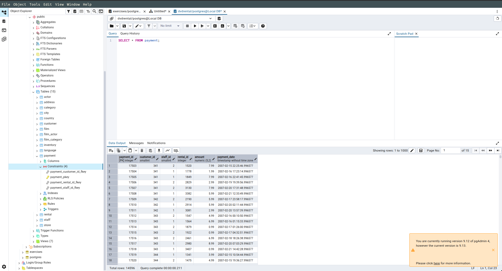
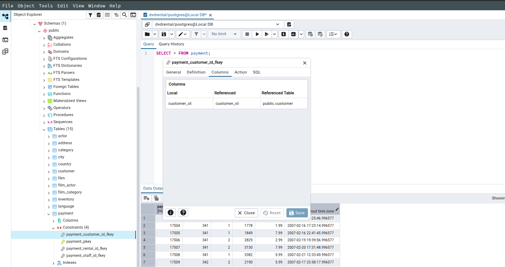
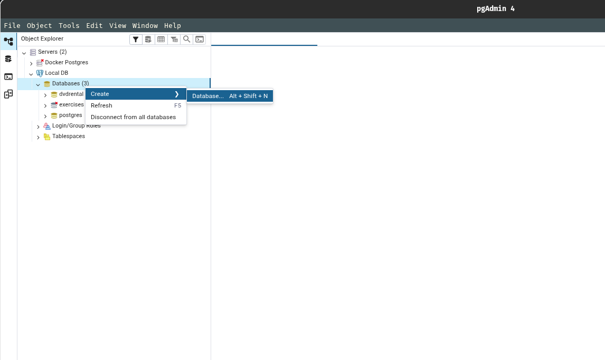
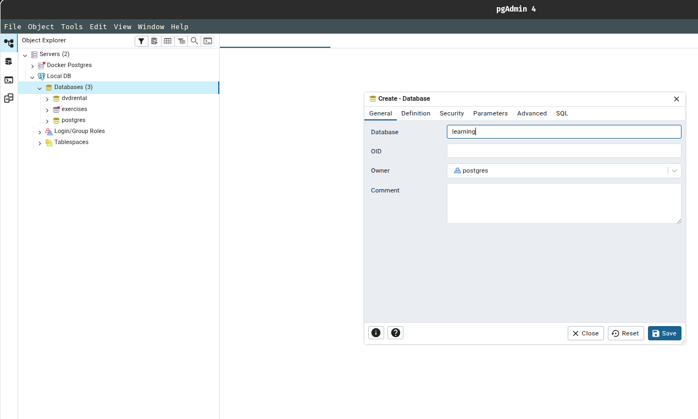
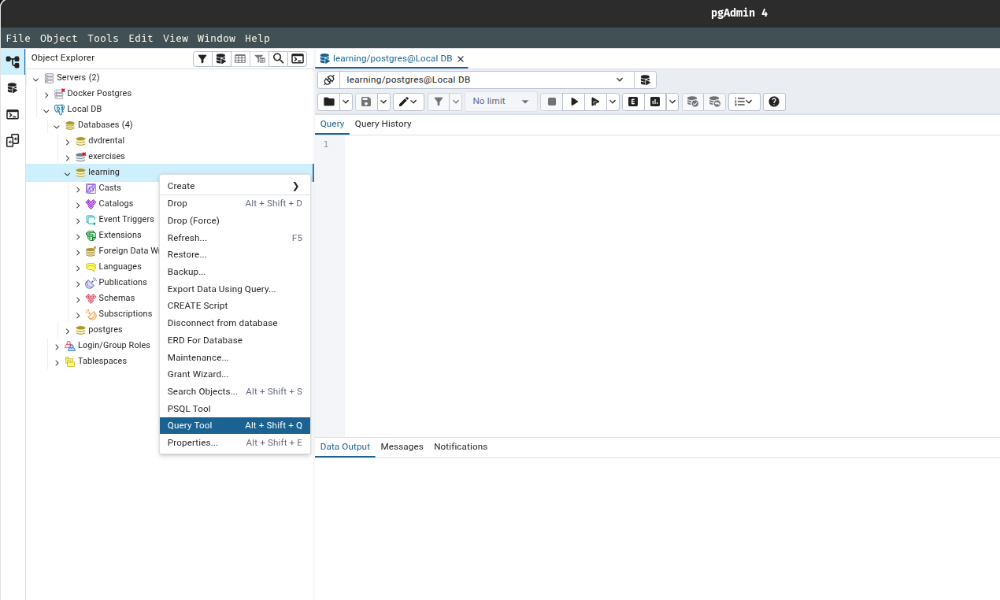
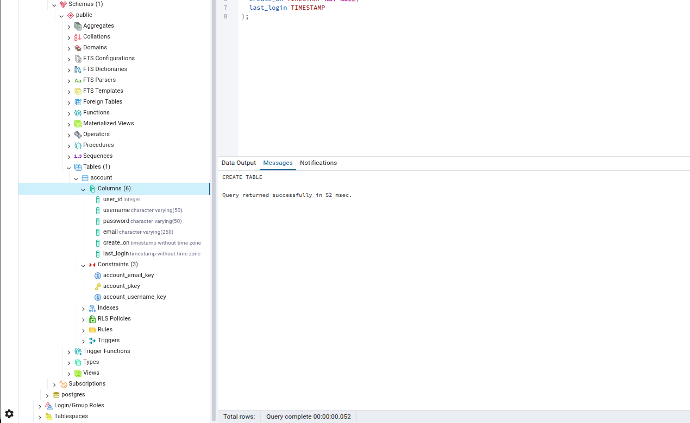

## Creating Databases & Tables

This guide covers a set of powerful SQL techniques that go beyond the basics, helping you write more expressive, efficient, and flexible queries. What's covered:

1. Data Types
2. Primary & Foreign Keys
3. Constraints
4. CREATE, INSERT, UPDATE
5. DELETE, ALTER & DROP

When creating a database and table, take your time to plan for long term storage. Remember you can always remove historical you've decided you aren't using, but you can't go back in time to add in information!

> [!NOTE]
> Always do a quick google search for best practices, and definitely refer the documentation to see your full range of options.

> Documentation here : [PostgreSQL Documentation: Data Types](https://www.postgresql.org/docs/current/datatype.html)

---

### 1. Primary & Foreign Keys

> View all from `payment` table.

```sql
SELECT * FROM payment;
```
<table border="1" class="dataframe">
  <thead>
    <tr style="text-align: right;">
      <th></th>
      <th>payment_id</th>
      <th>customer_id</th>
      <th>staff_id</th>
      <th>rental_id</th>
      <th>amount</th>
      <th>payment_date</th>
    </tr>
  </thead>
  <tbody>
    <tr>
      <th>0</th>
      <td>17503</td>
      <td>341</td>
      <td>2</td>
      <td>1520</td>
      <td>7.99</td>
      <td>2007-02-15 22:25:46.996577</td>
    </tr>
    <tr>
      <th>1</th>
      <td>17504</td>
      <td>341</td>
      <td>1</td>
      <td>1778</td>
      <td>1.99</td>
      <td>2007-02-16 17:23:14.996577</td>
    </tr>
    <tr>
      <th>2</th>
      <td>17505</td>
      <td>341</td>
      <td>1</td>
      <td>1849</td>
      <td>7.99</td>
      <td>2007-02-16 22:41:45.996577</td>
    </tr>
    <tr>
      <th>3</th>
      <td>17506</td>
      <td>341</td>
      <td>2</td>
      <td>2829</td>
      <td>2.99</td>
      <td>2007-02-19 19:39:56.996577</td>
    </tr>
    <tr>
      <th>4</th>
      <td>17507</td>
      <td>341</td>
      <td>2</td>
      <td>3130</td>
      <td>7.99</td>
      <td>2007-02-20 17:31:48.996577</td>
    </tr>
  </tbody>
</table>

- Primary Key : payment_id
- Foreign Keys : ??????

> Check if there are foreign keys in the `payment` table using the pgAdmin.

1. From the left side panel that shows the servers. Expand the tabs following the below pattern

```text
Servers → Local DB (Your Server Name) → databases → dvdrental → schemas → public → Tables → payment → Constraints
```



2. You will see the below list:

- payment_customer_id_fkey
- payment_pkey
- payment_rental_id_fkey
- payment_staff_id_fkey

*The **_pkey** represents the primary key for the payment table. Similarly the **_fkey** represents the foreign key for the payment table.*

3. Therefore for the `payment` table,

- Primary key : payment_id
- Foreign Keys : customer_id, staff_id, rental_id

4. Select one of the foreign key (I selected customer_id) and right click it. Then click on properties and then left click on columns tab.



*You should see a table named columns with headings : Local, Referenced, Referenced Table*

> Reference Table has the value **public.customer**, meaning that the foreign key customer_id of the `payment` table is referencing to the primary key of the `customer` table.

---

### 2. CREATE

2.1 Create new database using the pgAdmin.



2.2 Name the database as **learning**.



2.3 Open up the query tool by right clicking the newly created database.




*You have successfully created a new database..*

> Create an `account` table.

```sql
CREATE TABLE account (
  user_id SERIAL PRIMARY KEY,
  username VARCHAR(50) UNIQUE NOT NULL,
  password VARCHAR(50) NOT NULL,
  email VARCHAR(250) UNIQUE NOT NULL,
  create_on TIMESTAMP NOT NULL,
  last_login TIMESTAMP
);
```

```text
CREATE TABLE

Query returned successfully in 52 msec.
```


> [!NOTE]
> Notice that there is no constraint set for the last column (last_login), because it is not necessary that a user that created an account must also have a last login date. Also keep in mind that, you can only run this query once.

> Execute the query again and you will see the below result.

```text
ERROR:  relation "account" already exists 

SQL state: 42P07
```

You can also view the recently created by expanding the left side server panel along with the constraints.



> Create `job` table.

```sql
CREATE TABLE job (
  job_id SERIAL PRIMARY KEY,
  job_name VARCHAR(100) UNIQUE NOT NULL
);
```

```text
CREATE TABLE

Query returned successfully in 42 msec.
```

> Create `account_job` table, which references both `account` & `job` table.

```sql
CREATE TABLE account_job(
  user_id INTEGER REFERENCES account(user_id),
  job_id INTEGER REFERENCES job(job_id),
  hire_date TIMESTAMP
);
```

```text
CREATE TABLE

Query returned successfully in 43 msec.
```

---

### 3. INSERT

> Explore the `account` table.

```sql
SELECT * FROM account;
```
<table border="1" class="dataframe">
  <thead>
    <tr style="text-align: right;">
      <th></th>
      <th>user_id</th>
      <th>username</th>
      <th>password</th>
      <th>email</th>
      <th>create_on</th>
      <th>last_login</th>
    </tr>
  </thead>
  <tbody>
  </tbody>
</table>

*There are only columns and no records/rows because we haven't insert any data prior to creating this table.*

> Insert some rows into `account` table.

```sql
INSERT INTO account (username, password, email, created_on)
VALUES
(
  'siddhu', 'password', 'siddhu@gmail.com', CURRENT_TIMESTAMP
)
```
```text
INSERT 0 1

Query returned successfully in 42 msec.
```

> View the inserted `account` table.

```sql
SELECT * FROM account;
```
<table border="1" class="dataframe">
  <thead>
    <tr style="text-align: right;">
      <th></th>
      <th>user_id</th>
      <th>username</th>
      <th>password</th>
      <th>email</th>
      <th>create_on</th>
      <th>last_login</th>
    </tr>
  </thead>
  <tbody>
    <tr>
      <th>0</th>
      <td>1</td>
      <td>siddhu</td>
      <td>password</td>
      <td>siddhu@gmail.com</td>
      <td>2026-03-18 17:06:23.049040</td>
      <td>None</td>
    </tr>
  </tbody>
</table>

> Insert some rows into `job` table.

```sql
INSERT INTO job (job_name)
VALUES 
('Astronaut');
```
```text
INSERT 0 1

Query returned successfully in 60 msec.
```
```sql
INSERT INTO job (job_name)
VALUES 
('President');
```
```text
INSERT 0 1

Query returned successfully in 60 msec.
```

> View the inserted `job` table.

```sql
SELECT * FROM job;
```
<table border="1" class="dataframe">
  <thead>
    <tr style="text-align: right;">
      <th></th>
      <th>job_id</th>
      <th>job_name</th>
    </tr>
  </thead>
  <tbody>
    <tr>
      <th>0</th>
      <td>1</td>
      <td>Astronaut</td>
    </tr>
    <tr>
      <th>1</th>
      <td>2</td>
      <td>President</td>
    </tr>
  </tbody>
</table>

> Insert some rows into `account_job` table.

```sql
INSERT INTO account_job(user_id, job_id, hire_date)
VALUES 
(
  1, 1, CURRENT_TIMESTAMP
);
```
```text
INSERT 0 1

Query returned successfully in 44 msec.
```

> View the inserted `account_job` table.

```sql
SELECT * FROM account_job;
```
<table border="1" class="dataframe">
  <thead>
    <tr style="text-align: right;">
      <th></th>
      <th>user_id</th>
      <th>job_id</th>
      <th>hire_date</th>
    </tr>
  </thead>
  <tbody>
    <tr>
      <th>0</th>
      <td>1</td>
      <td>1</td>
      <td>2026-03-18 17:20:29.290135</td>
    </tr>
  </tbody>
</table>

> Try inserting a new row in the `account_job` table with an non existent user_id and job_id.

```sql
INSERT INTO account_job(user_id, job_id, hire_date)
VALUES 
(
  10, 12, CURRENT_TIMESTAMP
);
```
```text
ERROR:  insert or update on table "account_job" violates foreign key constraint "account_job_user_id_fkey"
Key (user_id)=(10) is not present in table "account". 

SQL state: 23503
Detail: Key (user_id)=(10) is not present in table "account".
```

> [!IMPORTANT]
> The above query throws an error because it violates the forign key constraint. Therefore, we have to make sure that when we are inserting something that has a foreign key constraint, it should also actually exist in the other tables.

---

### 4. UPDATE

> Explore the `account` table.

```sql
SELECT * FROM account;
```
<table border="1" class="dataframe">
  <thead>
    <tr style="text-align: right;">
      <th></th>
      <th>user_id</th>
      <th>username</th>
      <th>password</th>
      <th>email</th>
      <th>create_on</th>
      <th>last_login</th>
    </tr>
  </thead>
  <tbody>
    <tr>
      <th>0</th>
      <td>1</td>
      <td>siddhu</td>
      <td>password</td>
      <td>siddhu@gmail.com</td>
      <td>2026-03-18 17:06:23.049040</td>
      <td>None</td>
    </tr>
  </tbody>
</table>

> Update the last_login column to the current timestamp.

```sql
UPDATE account
SET last_login = CURRENT_TIMESTAMP;
```
```text
UPDATE 1

Query returned successfully in 41 msec.
```

> Verify the update.

```sql
SELECT * FROM account;
```
<table border="1" class="dataframe">
  <thead>
    <tr style="text-align: right;">
      <th></th>
      <th>user_id</th>
      <th>username</th>
      <th>password</th>
      <th>email</th>
      <th>create_on</th>
      <th>last_login</th>
    </tr>
  </thead>
  <tbody>
    <tr>
      <th>0</th>
      <td>1</td>
      <td>siddhu</td>
      <td>password</td>
      <td>siddhu@gmail.com</td>
      <td>2026-03-18 17:06:23.049040</td>
      <td>2026-03-19 13:33:58.673466</td>
    </tr>
  </tbody>
</table>

> [!NOTE]
> Note that this query updates all the rows from the last_login column to the current timestamp as we aren't setting any conditions using the **WHERE** clause.

> Explore the `job` table.

```sql
SELECT * FROM job;
```
<table border="1" class="dataframe">
  <thead>
    <tr style="text-align: right;">
      <th></th>
      <th>job_id</th>
      <th>job_name</th>
    </tr>
  </thead>
  <tbody>
    <tr>
      <th>0</th>
      <td>1</td>
      <td>Astronaut</td>
    </tr>
    <tr>
      <th>1</th>
      <td>2</td>
      <td>President</td>
    </tr>
  </tbody>
</table>

> Explore the `account_job` table.

```sql
SELECT * FROM account_job;
```
<table border="1" class="dataframe">
  <thead>
    <tr style="text-align: right;">
      <th></th>
      <th>user_id</th>
      <th>job_id</th>
      <th>hire_date</th>
    </tr>
  </thead>
  <tbody>
    <tr>
      <th>0</th>
      <td>1</td>
      <td>1</td>
      <td>2026-03-18 17:20:29.290135</td>
    </tr>
  </tbody>
</table>

> Update the hire_date based on another table.

```sql
UPDATE account_job
SET hire_date = account.create_on
FROM account
WHERE account_job.user_id = account.user_id;
```
```text
UPDATE 1

Query returned successfully in 60 msec.
```

> Verify the update.

```sql
SELECT * FROM account_job;
```
<table border="1" class="dataframe">
  <thead>
    <tr style="text-align: right;">
      <th></th>
      <th>user_id</th>
      <th>job_id</th>
      <th>hire_date</th>
    </tr>
  </thead>
  <tbody>
    <tr>
      <th>0</th>
      <td>1</td>
      <td>1</td>
      <td>2026-03-18 17:06:23.049040</td>
    </tr>
  </tbody>
</table>

```sql
SELECT * FROM account;
```
<table border="1" class="dataframe">
  <thead>
    <tr style="text-align: right;">
      <th></th>
      <th>user_id</th>
      <th>username</th>
      <th>password</th>
      <th>email</th>
      <th>create_on</th>
      <th>last_login</th>
    </tr>
  </thead>
  <tbody>
    <tr>
      <th>0</th>
      <td>1</td>
      <td>siddhu</td>
      <td>password</td>
      <td>siddhu@gmail.com</td>
      <td>2026-03-18 17:06:23.049040</td>
      <td>2026-03-19 13:33:58.673466</td>
    </tr>
  </tbody>
</table>

> Update the last_login to the current timestamp, but this time also return the updated rows.

```sql
UPDATE account
SET last_login = CURRENT_TIMESTAMP
RETURNING email, last_login;
```
<table border="1" class="dataframe">
  <thead>
    <tr style="text-align: right;">
      <th></th>
      <th>email</th>
      <th>last_login</th>
    </tr>
  </thead>
  <tbody>
    <tr>
      <th>0</th>
      <td>siddhu@gmail.com</td>
      <td>2026-03-19 13:49:29.602175</td>
    </tr>
  </tbody>
</table>

---

### 5. DELETE

> Explore the `job` table.

```sql
SELECT * FROM job;
```
<table border="1" class="dataframe">
  <thead>
    <tr style="text-align: right;">
      <th></th>
      <th>job_id</th>
      <th>job_name</th>
    </tr>
  </thead>
  <tbody>
    <tr>
      <th>0</th>
      <td>1</td>
      <td>Astronaut</td>
    </tr>
    <tr>
      <th>1</th>
      <td>2</td>
      <td>President</td>
    </tr>
  </tbody>
</table>

> Add a new row with job title 'Cowboy'.

```sql
INSERT INTO job(job_name)
VALUES 
  ('Cowboy');
```

```text
INSERT 0 1

Query returned successfully in 67 msec.
```

> Explore the newly updated `job` table.

```sql
SELECT * FROM job;
```
<table border="1" class="dataframe">
  <thead>
    <tr style="text-align: right;">
      <th></th>
      <th>job_id</th>
      <th>job_name</th>
    </tr>
  </thead>
  <tbody>
    <tr>
      <th>0</th>
      <td>1</td>
      <td>Astronaut</td>
    </tr>
    <tr>
      <th>1</th>
      <td>2</td>
      <td>President</td>
    </tr>
    <tr>
      <th>2</th>
      <td>3</td>
      <td>Cowboy</td>
    </tr>
  </tbody>
</table>

> Delete the rescetly added row from the `job` table.

```sql
DELETE FROM job
WHERE job_name = 'Cowboy'
RETURNING job_id, job_name;
```

<table border="1" class="dataframe">
  <thead>
    <tr style="text-align: right;">
      <th></th>
      <th>job_id</th>
      <th>job_name</th>
    </tr>
  </thead>
  <tbody>
    <tr>
      <th>0</th>
      <td>3</td>
      <td>Cowboy</td>
    </tr>
  </tbody>
</table>


> [!NOTE]
> If you run the above DELETE query again it will return nothing as the rows has already been removed from the table.

> Recheck the `job` table to verify the deletion of the row.

```sql
SELECT * FROM job;
```
<table border="1" class="dataframe">
  <thead>
    <tr style="text-align: right;">
      <th></th>
      <th>job_id</th>
      <th>job_name</th>
    </tr>
  </thead>
  <tbody>
    <tr>
      <th>0</th>
      <td>1</td>
      <td>Astronaut</td>
    </tr>
    <tr>
      <th>1</th>
      <td>3</td>
      <td>President</td>
    </tr>
  </tbody>
</table>