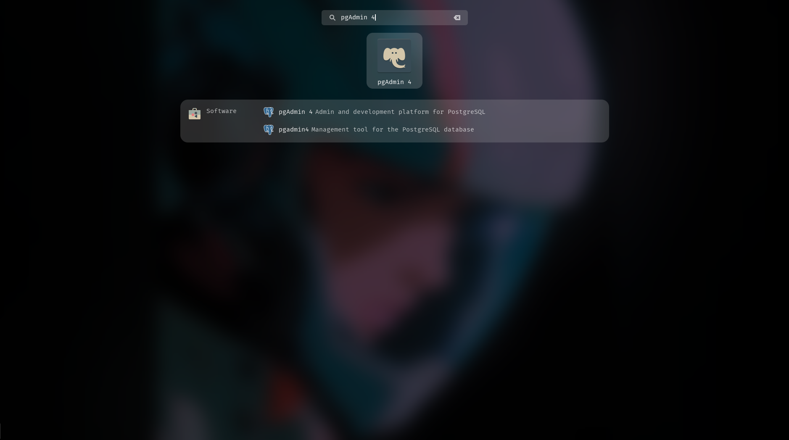
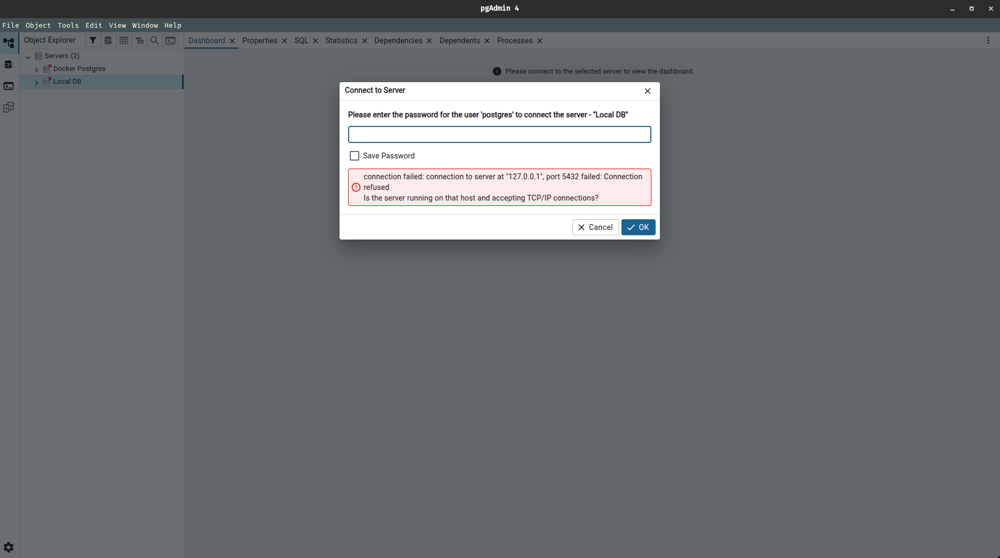
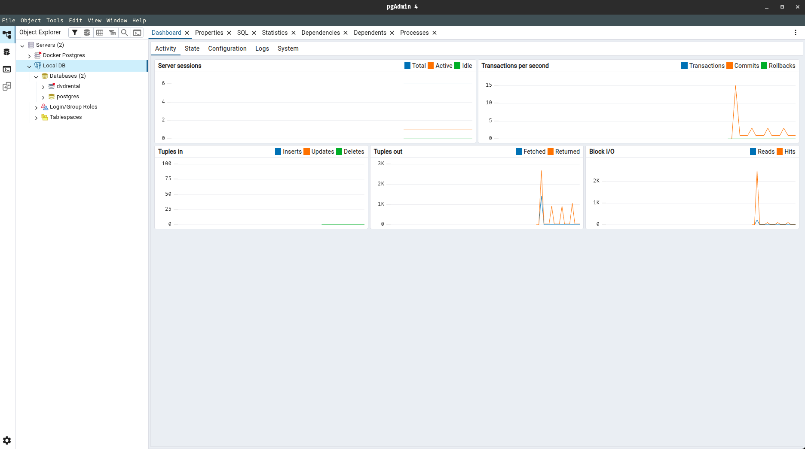

## PgAdmin Overview

Now that we have installed and setup our PgAdmin using the previous [pgadmin setup guide](https://github.com/SiddhuShkya/SQL-Bootcamp-Zero-To-Hero/blob/main/docs/Course%20materials/postgresql-and-pgadmin-setup.md), let's jump into some important features. This is an optional part of this course.

### Starting PgAdmin Application

1. Let's begin by opening the PgAdmin from the apps menu. You can run it like an normal app (By double left clicking the app icon).



2. Extend the **Servers**, and click on the previously created server which is `Local DB`.

> After clicking on your server (trying to connect to server), you might encounter an error like the below one:



```python
## Error Message

connection failed: connection to server at "127.0.0.1", port 5432 failed: Connection refused
Is the server running on that host and accepting TCP/IP connections?
```

> To fix this error, we need to start our server by running the below command from the terminal.

```sh
sudo systemctl start postgresql
```

> Click again on your **Local DB** server, and now you should see that your connection to server has been made.



*Now that our pgadmin is running and also connected to the server successfully, lets tryout some of its features..*

---

### PgAdmin Features

Here is the content in Markdown format, ready for you to copy and paste into your document:

* **The Query Tool (SQL IDE)** -> This is the heart of pgAdmin. It’s a powerful editor for writing and executing SQL queries, featuring syntax highlighting, auto-completion (Intellisense), and a "Scratch Pad" for temporary notes.

    > **How to Access:** Select a database in the Browser tree (left panel), then click the Query Tool icon (a lightning bolt over a table) in the top toolbar, or go to `Tools` > `Query Tool`.

---

* **ERD Tool (Entity Relationship Diagram)** -> This tool allows you to visualize your database schema or design a new one from scratch. You can drag and drop tables, define relationships, and automatically generate the SQL script to build the actual database.

    > **How to Access:** Right-click on a **Database** or **Schema** in the Browser tree and select `ERD For Database`. Alternatively, go to `Tools` > `ERD Tool` to start a blank project.

---

* **Schema Diff** -> This utility helps you compare two database objects (such as two different databases or schemas) to find structural discrepancies. It can generate the "synchronization script" needed to make the target database match the source.

    > **How to Access:** Go to the `Tools` menu and select `Schema Diff`. A panel will open where you can select your **Source** and **Target** servers and databases for comparison.

---

* **Import/Export Data Tool** -> Instead of writing complex `COPY` commands in the terminal, this GUI tool lets you move data between your tables and external files (like CSV or TXT). It handles encoding, delimiters, and column mapping via a simple dialog box.

    > **How to Access:** Right-click on a specific **Table** in the Browser tree and select `Import/Export Data...`.

---

* **Real-time Monitoring Dashboard** -> The Dashboard provides a live visual overview of your server's health. It displays graphs for active sessions, transactions per second, and tuple activity, helping you spot performance bottlenecks at a glance.

    > **How to Access:** Click on a **Server** or **Database** in the Browser tree. In the main right-hand pane, click the **Dashboard** tab (located next to the Properties and SQL tabs).

---

* **Backup and Restore** -> This feature provides a graphical interface for the `pg_dump` and `pg_restore` utilities. It allows you to create compressed backups of your entire database or specific objects and restore them without using the command line.

    > **How to Access:** Right-click on a **Database** or **Table** in the Browser tree and select `Backup...` or `Restore...`.

---

# <div align="center">Thank You for Going Through This Guide! 🙏✨</div>