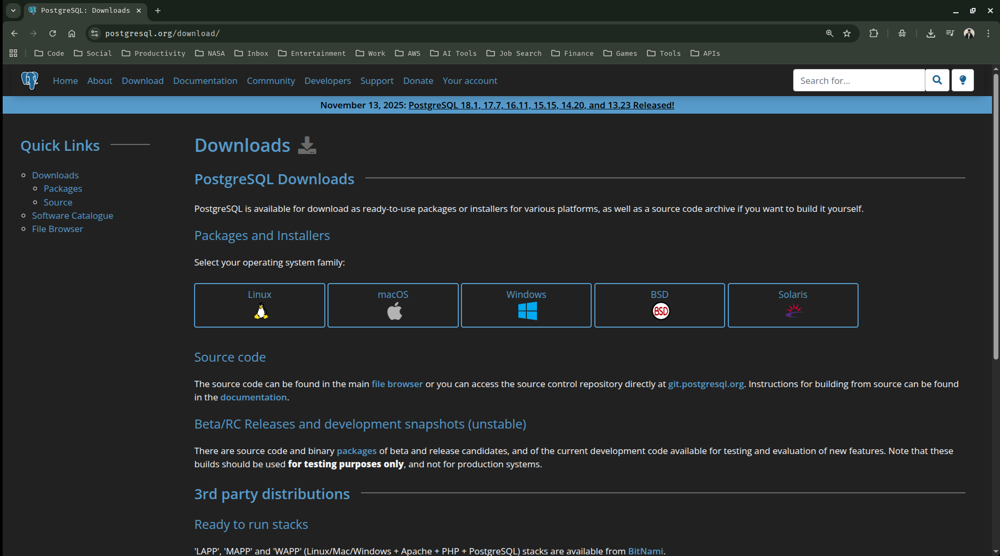

## PostgreSQL & PgAdmin - Installation & Set-Up

In this guide, we are going to set up and install **PostgreSQL** and **PgAdmin** to our local machine.

- `PostgreSQL` → SQL Engine that stores data and reads queries and returns information.
- `PgAdmin` → Graphical User Interface (GUI) for connecting with PostgreSQL.

> [!NOTE]
> Please make sure that you follow each step in order carefully and do not open the dvdrental.tar file directly. Also do not forget your PostgreSQL password.

--- 

Lets go ahead with the installation & setups:

### 1. Installing PostgreSQL 

1.1 Go to your any web/internet browser and go to the official download page of postgresql website which is the link given below.

```text
https://www.postgresql.org/download/
```

You should be able to see something like the below in your screen:



1.2 Click on your operating system family that is being used by your device currently.

- Linux ([Ubuntu PostgreSQL](https://www.postgresql.org/download/linux/ubuntu/))
- macOS ([[macOS PostgreSQL](https://www.postgresql.org/download/macosx/)])
- Windows ([Windows PostgreSQL](https://www.postgresql.org/download/windows/))

> In my case, i am using Linux (Ubuntu Distribution)

> [!IMPORTANT]
> The steps to install and setup PostgreSQL and PgAdmin can greatly differ based on your currently used Operating System. Hence, you should only follow the below steps if you are using Linux (Ubuntu Distribution)

1.3 Open up your terminal and copy, paste and run the below commands one by one:

- To install PostgreSQL on Ubuntu, use the apt command below:

    ```sh
    sudo apt install postgresql postgresql-contrib
    ```
    *Enter your password and wait for the installation to complete*

- Additionally you can also specify the version of postgresql you want to install, using the below installation command.

    ```sh
    sudo apt install postgresql-18
    ```
    *Replace "18" by the version you want*

- After completing the installation, verify the installation with the below commands

    > Command 1

    ```sh
    psql --version
    ```
    ```text
    psql (PostgreSQL) 16.11 (Ubuntu 16.11-0ubuntu0.24.04.1)
    ```

    > Command 2

    ```sh
    sudo systemctl status postgresql
    ```
    ```sh
    ● postgresql.service - PostgreSQL RDBMS
        Loaded: loaded (/usr/lib/systemd/system/postgresql.service; enabled; preset: enabled)
        Active: active (exited) since Thu 2026-02-05 12:14:31 +0545; 9min ago
    Main PID: 175922 (code=exited, status=0/SUCCESS)
            CPU: 4ms

    Feb 05 12:14:31 ubuntu systemd[1]: Starting postgresql.service - PostgreSQL RDBMS...
    Feb 05 12:14:31 ubuntu systemd[1]: Finished postgresql.service - PostgreSQL RDBMS.
    ```

1.4 You can now access the PostreSQL Prompt through the terminal

> PostgreSQL uses a concept called **roles** for authentication. By default, it creates a system user named `postgres`. There are two ways to access the database:

- **Option A :** Switch to the Postgres User (Traditional)

    ```sh
    siddhu@ubuntu:~$ sudo -i -u postgres
    postgres@ubuntu:~$ psql
    psql (16.11 (Ubuntu 16.11-0ubuntu0.24.04.1))
    Type "help" for help.

    postgres=# 
    ```

    > To quit you can use '\q' followed by 'exit'.

    ```sh
    postgres=# \q
    postgres@ubuntu:~$ exit
    logout
    ```

- **Option B :** Use Sudo Directly (Faster)

    > You can run the psql command as the postgres user without switching accounts

    ```sh
    siddhu@ubuntu:~$ sudo -u postgres psql
    psql (16.11 (Ubuntu 16.11-0ubuntu0.24.04.1))
    Type "help" for help.

    postgres=# 
    ```
    > To quit use '\q' or 'exit'

1.5 Let's also set up a password for the `postgres` superuser so that we can connect to PgAdmin, later on

- Enter the PostgreSQL prompt:

    ```sh
    siddhu@ubuntu:~$ sudo -u postgres psql
    psql (16.11 (Ubuntu 16.11-0ubuntu0.24.04.1))
    Type "help" for help.
    ```

- Run the ALTER command: (Replace 'your_secure_password' with whatever you want, but keep the single quotes).

    ```sql
    ALTER USER postgres PASSWORD 'your_secure_password';
    ```

- Exit

    ```sh
    postgres=# \q
    siddhu@ubuntu:~$ 
    ```

> [!IMPORTANT]
> *System User vs Database User (PostgreSQL)*
>
> It helps to visualize that there are **two separate `postgres` identities** on your machine:
>
> | Identity | Level | Purpose |
> |--------|-------|---------|
> | **Ubuntu User (`postgres`)** | OS level | Owns PostgreSQL files and runs the database service |
> | **PostgreSQL Role (`postgres`)** | Database level | Superuser inside PostgreSQL with full privileges |
>
> ⚠️ These two are **independent** but commonly linked for administrative convenience.


---

### 2. Installling PgAdmin (GUI)


