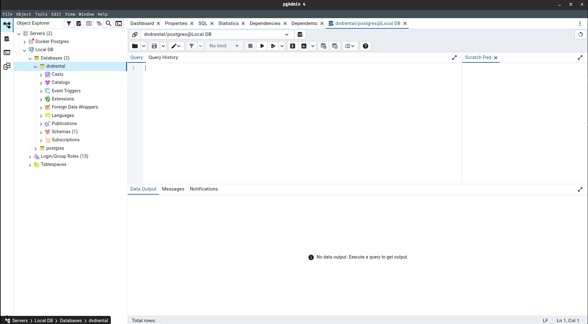
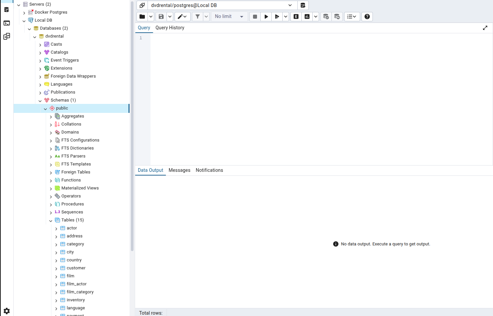

## SQL Statements Using dvdrental database

This document contains all the sql statements/queries we executed for this course using the postgresql and pgadmin from the dvdrental datbase.

> Open up your PgAdmin. Then connect your Local DB server and open up your Query tool from the dvdrental database



> See the tables that are present in the dvdrental database.

> [!IMPORTANT]
> You can see the tables that inside the database by extending: database (dvdrental) -> Schemas -> Public -> Tables. Similarly you can extend a specific table to also see their columns.



> We have the following 15 available tables in our dvdrental database

- actor 
- address 
- category 
- city 
- country 
- customer 
- film
- film_actor
- film_category
- inventory
- language
- payment
- rental
- staff
- store

*Now that we know all the tables that are inside dvdrental database, let's move forward write some SQL queries to retrieve some informations*

---

### 1. SQL Statement Fundamentals

1.1 **SELECT** 

- View all columns from `actor`

```sql
SELECT * FROM actor;
```
<table border="1" class="dataframe">
  <thead>
    <tr style="text-align: right;">
      <th></th>
      <th>actor_id</th>
      <th>first_name</th>
      <th>last_name</th>
      <th>last_update</th>
    </tr>
  </thead>
  <tbody>
    <tr>
      <th>0</th>
      <td>1</td>
      <td>Penelope</td>
      <td>Guiness</td>
      <td>2013-05-26 14:47:57.62</td>
    </tr>
    <tr>
      <th>1</th>
      <td>2</td>
      <td>Nick</td>
      <td>Wahlberg</td>
      <td>2013-05-26 14:47:57.62</td>
    </tr>
    <tr>
      <th>2</th>
      <td>3</td>
      <td>Ed</td>
      <td>Chase</td>
      <td>2013-05-26 14:47:57.62</td>
    </tr>
    <tr>
      <th>3</th>
      <td>4</td>
      <td>Jennifer</td>
      <td>Davis</td>
      <td>2013-05-26 14:47:57.62</td>
    </tr>
    <tr>
      <th>4</th>
      <td>5</td>
      <td>Johnny</td>
      <td>Lollobrigida</td>
      <td>2013-05-26 14:47:57.62</td>
    </tr>
  </tbody>
</table>
</div>

> Returns all the columns from the `actor` table

- View only one column from `actor`

```sql
SELECT first_name FROM actor;
```
<table border="1" class="dataframe">
  <thead>
    <tr style="text-align: right;">
      <th></th>
      <th>first_name</th>
    </tr>
  </thead>
  <tbody>
    <tr>
      <th>0</th>
      <td>Penelope</td>
    </tr>
    <tr>
      <th>1</th>
      <td>Nick</td>
    </tr>
    <tr>
      <th>2</th>
      <td>Ed</td>
    </tr>
    <tr>
      <th>3</th>
      <td>Jennifer</td>
    </tr>
    <tr>
      <th>4</th>
      <td>Johnny</td>
    </tr>
  </tbody>
</table>
</div>

> Returns only the first_name column from the `actor` table

- View first_name and last_name from `actor` table

```sql
SELECT first_name, last_name FROM actor;
```

<table border="1" class="dataframe">
  <thead>
    <tr style="text-align: right;">
      <th></th>
      <th>first_name</th>
      <th>last_name</th>
    </tr>
  </thead>
  <tbody>
    <tr>
      <th>0</th>
      <td>Penelope</td>
      <td>Guiness</td>
    </tr>
    <tr>
      <th>1</th>
      <td>Nick</td>
      <td>Wahlberg</td>
    </tr>
    <tr>
      <th>2</th>
      <td>Ed</td>
      <td>Chase</td>
    </tr>
    <tr>
      <th>3</th>
      <td>Jennifer</td>
      <td>Davis</td>
    </tr>
    <tr>
      <th>4</th>
      <td>Johnny</td>
      <td>Lollobrigida</td>
    </tr>
  </tbody>
</table>
</div>

> Returns first_name and last_name from `actor` table

> [!NOTE]
> The order of the column names matters in the query as it determines the order of columns in the result set. [SELECT last_name, first_name] will display last_name in the first column and first_name in the second column.

1.2 **SELECT DISTINCT**

